# Population Denominator Intelligence & Beneficiary Deduplication for HCM
## Production-Grade Architecture Design Document

**Version:** 2.0
**Date:** 2026-06-10
**Prepared for:** eGov Foundation Architecture Review
**Authors:** Principal Architecture Team
**Status:** Revised Draft — Aligned with HCM Java Backend

---

## Table of Contents

1. [Executive Summary](#1-executive-summary)
2. [Problem Analysis](#2-problem-analysis)
3. [HCM Architecture Understanding](#3-hcm-architecture-understanding)
4. [Gap Analysis of Current System](#4-gap-analysis-of-current-system)
5. [Part 1: Population Denominator Intelligence](#5-part-1-population-denominator-intelligence)
6. [Part 2: Beneficiary Deduplication Engine](#6-part-2-beneficiary-deduplication-engine)
7. [Recommended Technology Stack](#7-recommended-technology-stack)
8. [API Contracts](#8-api-contracts)
9. [Database Schema](#9-database-schema)
10. [GIS Architecture](#10-gis-architecture)
11. [AI/ML Architecture](#11-aiml-architecture)
12. [Flutter Package Architecture](#12-flutter-package-architecture)
13. [Offline Deduplication — Detailed Flow](#13-offline-deduplication--detailed-flow)
14. [PDI Insights UI Design](#14-pdi-insights-ui-design)
15. [Rollout Strategy](#15-rollout-strategy)
16. [Development Roadmap](#16-development-roadmap-8-weeks-2-students)
17. [Risks, Assumptions, and Mitigation](#17-risks-assumptions-and-mitigation)

---

## 1. Executive Summary

This document presents the end-to-end architecture for two capabilities to be integrated into the DIGIT Health Campaign Management (HCM) platform:

1. **Population Denominator Intelligence (PDI):** A geospatial intelligence layer that estimates expected populations and households for campaign areas using WorldPop population rasters and Google Open Buildings footprints, enabling gap detection between expected and registered populations.

2. **Beneficiary Deduplication Engine (BDE):** An offline-capable, on-device fuzzy matching engine packaged as a reusable Flutter SDK that detects likely duplicate beneficiary registrations using probabilistic record linkage.

Both modules are designed as independent, modular components that align with DIGIT platform principles: microservice-based, API-first, offline-capable, and open-source.

### Key Design Decisions

| Decision | Rationale |
|----------|-----------|
| Server-side population intelligence, client-side deduplication | PDI needs large raster datasets; BDE must work offline |
| PostgreSQL + PostGIS for geospatial backend | DIGIT already uses PostgreSQL; PostGIS is the standard for spatial queries |
| Drift (SQLite) for on-device dedup | DIGIT HCM Flutter app already uses Drift for local persistence |
| Pre-computed settlement summaries over real-time raster queries | Performance on low-bandwidth connections; caching for offline use |
| Weighted multi-attribute scoring for dedup over ML-only approach | Explainability requirement; works on low-end devices without ML runtime |

---

## 2. Problem Analysis

### 2.1 The Coverage Accuracy Problem

```
┌─────────────────────────────────────────────────────┐
│            Current Coverage Calculation              │
│                                                      │
│  Coverage = Beneficiaries Served / Registered        │
│                                                      │
│  Problem: "Registered" ≠ "Actual Population"         │
│                                                      │
│  If 800 registered out of 1200 actual:               │
│    Current system says: 800/800 = 100% ✓             │
│    Reality:             800/1200 = 67% ✗             │
│                                                      │
│  400 people are invisible to the system.             │
└─────────────────────────────────────────────────────┘
```

### 2.2 The Duplication Problem

```
┌─────────────────────────────────────────────────────┐
│            Current Beneficiary Tracking              │
│                                                      │
│  Round 1: "Rahim, M, Age 5, Village X" → Registered │
│  Round 2: "Raheem, M, Age 5, Village X" → Registered│
│  Round 3: "Rahim, M, Age 6, Village X" → Registered │
│                                                      │
│  System counts: 3 beneficiaries served               │
│  Reality:       1 beneficiary served 3 times         │
│                                                      │
│  Coverage inflated by 3x for this individual.        │
└─────────────────────────────────────────────────────┘
```

### 2.3 Combined Impact

These two problems compound each other. The denominator is underestimated (missing unregistered populations) while the numerator is overestimated (duplicate registrations). The result is coverage metrics that can be off by 30-50% in some regions, leading to misallocation of campaign resources and communities remaining unserved across multiple campaign cycles.

---

## 3. HCM Architecture Understanding

### 3.1 DIGIT Platform Architecture

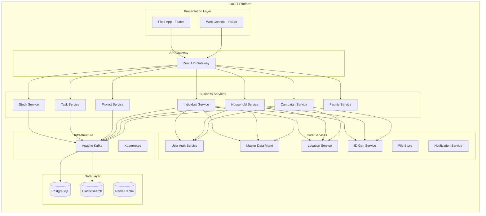

### 3.2 HCM Campaign Lifecycle

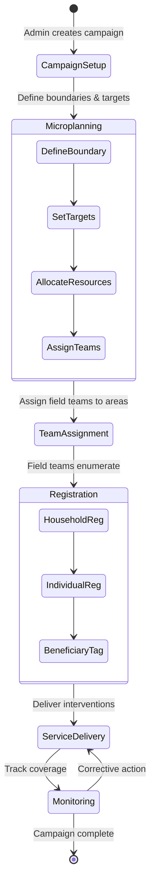

### 3.3 Key HCM Data Models (from DIGIT docs)

**Household Model:**
- `id` (system-generated GUID)
- `clientReferenceId` (device-generated for offline)
- `householdId` (human-readable identifier)
- `memberCount`
- `address` (with GPS coordinates)
- `tenantId`, `rowVersion`, `auditDetails`

**Individual Model:**
- `id`, `clientReferenceId`
- `name` (givenName, familyName, otherNames)
- `isHeadOfHousehold` (boolean)
- `identifierType`, `identifierNumber`
- `dateOfBirth` / `age`
- `gender` (male, female, other)
- `mobileNumber`
- `tenantId`, `rowVersion`, `auditDetails`

**Project Beneficiary Model:**
- Links an individual to a campaign project
- Tracks service delivery status per beneficiary per campaign round

### 3.4 Offline Sync Architecture (Existing HCM)

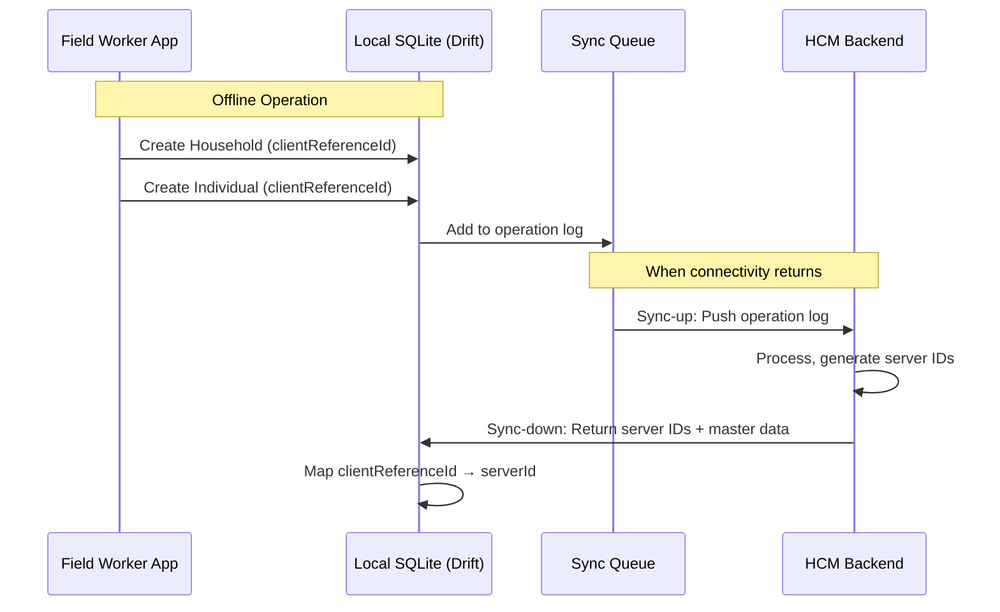

---

## 4. Gap Analysis of Current System

### 4.1 Functional Gaps

| Area | Current State | Gap | Impact |
|------|--------------|-----|--------|
| **Population Denominator** | Relies solely on field enumeration | No external population baseline | Coverage calculation accuracy is fundamentally flawed |
| **Household Discovery** | Only knows registered households | Cannot detect unenumerated settlements | Entire communities remain invisible |
| **Beneficiary Uniqueness** | No deduplication at registration time | Duplicates inflate service counts | Campaign reporting is unreliable |
| **Coverage Gap Visibility** | No gap visualization on maps | Supervisors cannot identify under-covered areas | Resources misallocated |
| **Risk Prioritization** | Manual prioritization by supervisors | No data-driven risk scoring | High-risk areas may be deprioritized |
| **Geospatial Intelligence** | Basic boundary management | No satellite/building footprint integration | Physical reality disconnected from planning data |

### 4.2 Technical Gaps

| Component | Current | Needed |
|-----------|---------|--------|
| GIS Backend | Location service with boundary polygons | PostGIS with raster processing, building footprint queries |
| Population Data | None external | WorldPop raster ingestion and zonal statistics pipeline |
| Building Data | None | Google Open Buildings integration for settlement detection |
| On-device Matching | None | Fuzzy string matching + weighted scoring engine |
| Offline Dedup DB | Drift/SQLite for CRUD only | Indexed local search with phonetic keys and trigrams |
| Visualization | Dashboard charts only | Choropleth maps with gap heatmaps |

### 4.3 What the System Gets Right (Leverage Points)

- Offline-first architecture with operation log sync is well-designed
- `clientReferenceId` pattern enables offline entity creation
- Drift/SQLite local persistence is extensible for dedup indexes
- Microservice architecture allows adding new services without modifying core
- Kafka event bus enables loose coupling of new analytics consumers
- PostgreSQL backend is extensible with PostGIS

---

## 5. Part 1: Population Denominator Intelligence

### 5.1 System Architecture

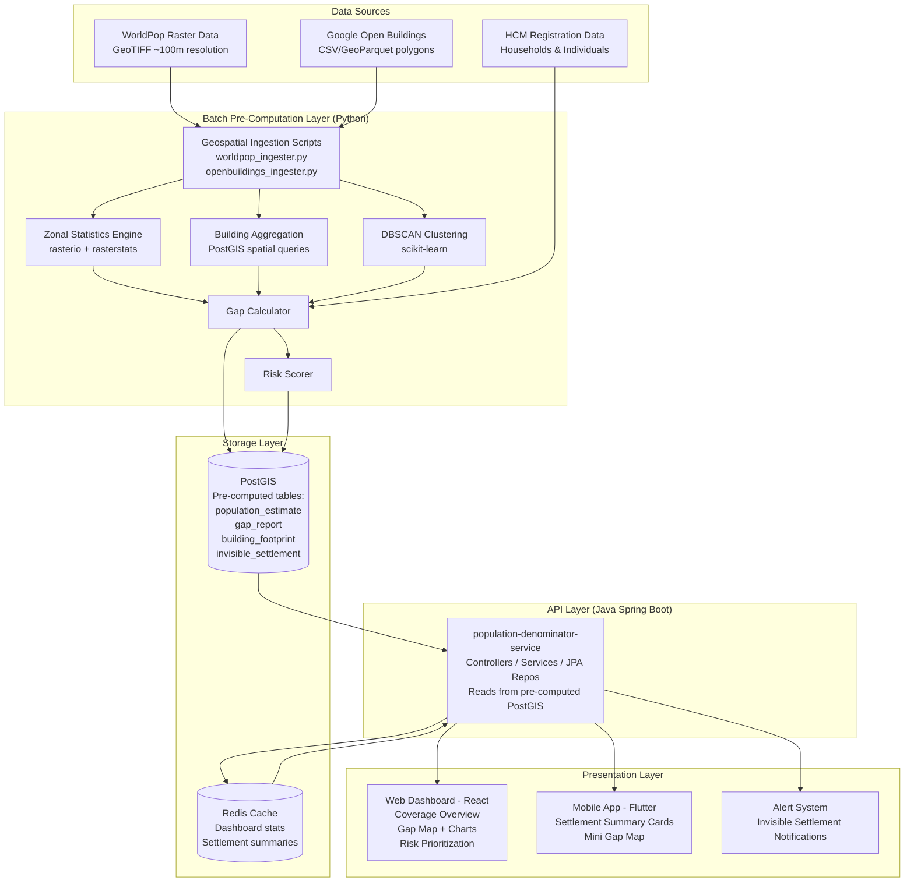

### 5.2 Feature 1: Population Estimation Engine

**Processing Pipeline:**

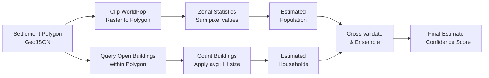

**Algorithm: Population Estimation**

```
FUNCTION estimatePopulation(settlementPolygon):
    // Method 1: WorldPop raster zonal statistics
    rasterClip = clipRaster(worldPopRaster, settlementPolygon)
    worldPopEstimate = sumPixelValues(rasterClip)

    // Method 2: Building-count extrapolation
    buildings = queryOpenBuildings(settlementPolygon, confidenceThreshold=0.70)
    buildingCount = count(buildings)
    avgHouseholdSize = getRegionalAvgHHSize(settlementPolygon.region)  // from census/MDMS
    buildingEstimate = buildingCount * avgHouseholdSize

    // Ensemble: weighted average with confidence
    IF abs(worldPopEstimate - buildingEstimate) / worldPopEstimate < 0.3:
        // Methods agree within 30% — high confidence
        population = (0.6 * worldPopEstimate) + (0.4 * buildingEstimate)
        confidence = 0.85 + (0.15 * (1 - divergence))
    ELSE:
        // Methods diverge — use WorldPop as primary, flag for review
        population = worldPopEstimate
        confidence = 0.50 + (0.2 * min(buildingCount/10, 1))

    households = buildingCount  // buildings are the direct proxy
    RETURN { population, households, confidence, method: "ensemble" }
```

**Output Schema:**
```json
{
  "settlementId": "SET-001",
  "boundaryId": "BND-VILLAGE-042",
  "estimatedPopulation": 1200,
  "estimatedHouseholds": 240,
  "confidence": 0.89,
  "method": "worldpop_openbuildings_ensemble",
  "dataVersions": {
    "worldPop": "2023-unconstrained-100m",
    "openBuildings": "v3-2023-05"
  },
  "computedAt": "2026-06-10T12:00:00Z"
}
```

### 5.3 Feature 2: Gap Detection Engine

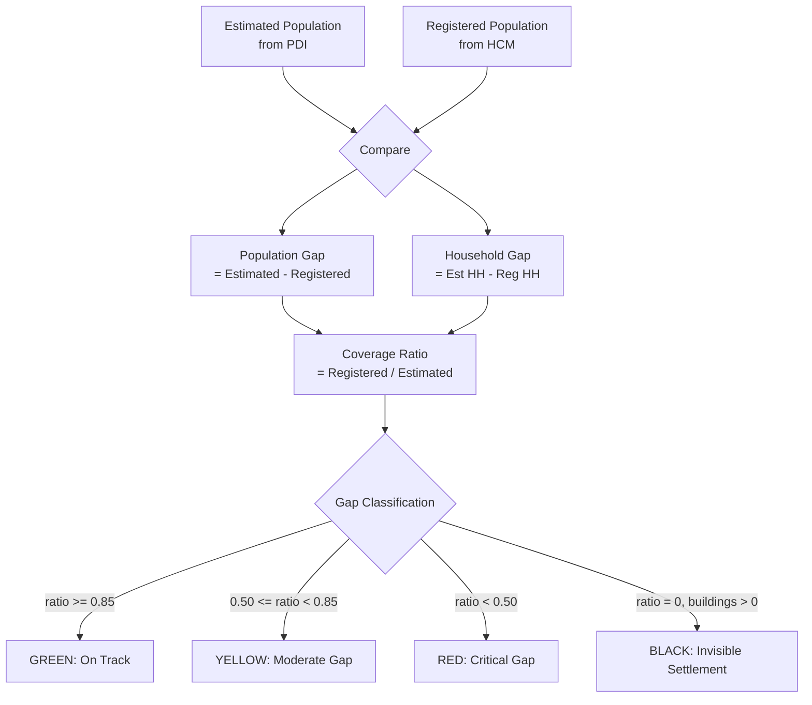

**Gap Report Schema:**
```json
{
  "settlementId": "SET-001",
  "campaignId": "CAMP-2026-MALARIA-01",
  "snapshot": {
    "estimatedPopulation": 1200,
    "registeredPopulation": 680,
    "estimatedHouseholds": 240,
    "registeredHouseholds": 150,
    "populationGap": 520,
    "householdGap": 90,
    "coverageRatio": 0.567,
    "gapClassification": "YELLOW"
  },
  "generatedAt": "2026-06-10T12:00:00Z"
}
```

### 5.4 Feature 3: GIS Visualization Layer

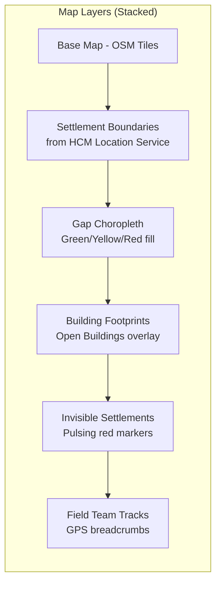

**Visualization Technology:**
- **Web Console:** Leaflet.js or MapLibre GL JS with GeoJSON tile layers
- **Mobile App:** `flutter_map` package with offline MBTiles cache
- **Tile Server:** Martin (Rust-based MVT server from PostGIS) or pg_tileserv

### 5.5 Feature 4: Invisible Settlement Detection

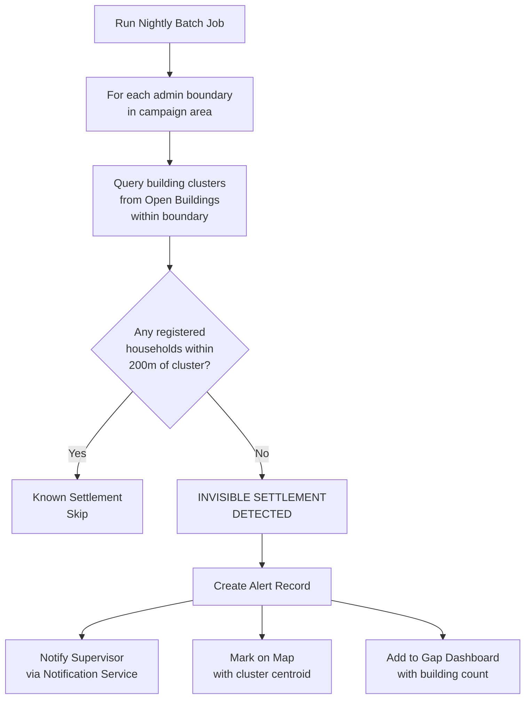

**Clustering Algorithm:**
- DBSCAN (Density-Based Spatial Clustering) on building centroids
  - `eps`: 100 meters (building proximity threshold)
  - `min_samples`: 3 buildings (minimum cluster size)
- Each cluster represents a potential settlement
- Cross-reference with HCM household GPS coordinates (200m buffer match)

### 5.6 Feature 5: Settlement Risk Scoring

**Risk Score Model:**

```
FUNCTION computeRiskScore(settlement):
    // Normalize each factor to 0-1 range
    gapScore = min(populationGap / estimatedPopulation, 1.0)        // weight: 0.30
    densityScore = normalize(buildingDensity, regional_stats)        // weight: 0.15
    accessScore = 1 - normalize(distToNearestFacility, max=50km)    // weight: 0.20
    historyScore = 1 - avgPastCoverageRatio                          // weight: 0.25
    missedScore = missedChildrenRate                                  // weight: 0.10

    rawScore = (0.30 * gapScore)
             + (0.15 * densityScore)
             + (0.20 * accessScore)
             + (0.25 * historyScore)
             + (0.10 * missedScore)

    riskScore = round(rawScore * 100)

    priority = CASE
        WHEN riskScore >= 75 THEN "CRITICAL"
        WHEN riskScore >= 50 THEN "HIGH"
        WHEN riskScore >= 25 THEN "MEDIUM"
        ELSE "LOW"

    RETURN { riskScore, priority, factors: {...} }
```

This is a weighted linear model. The weights are intentionally transparent and configurable by campaign managers through MDMS configuration, satisfying the explainability constraint. A gradient-boosted model could replace this later if labeled training data (actual coverage outcomes) becomes available.

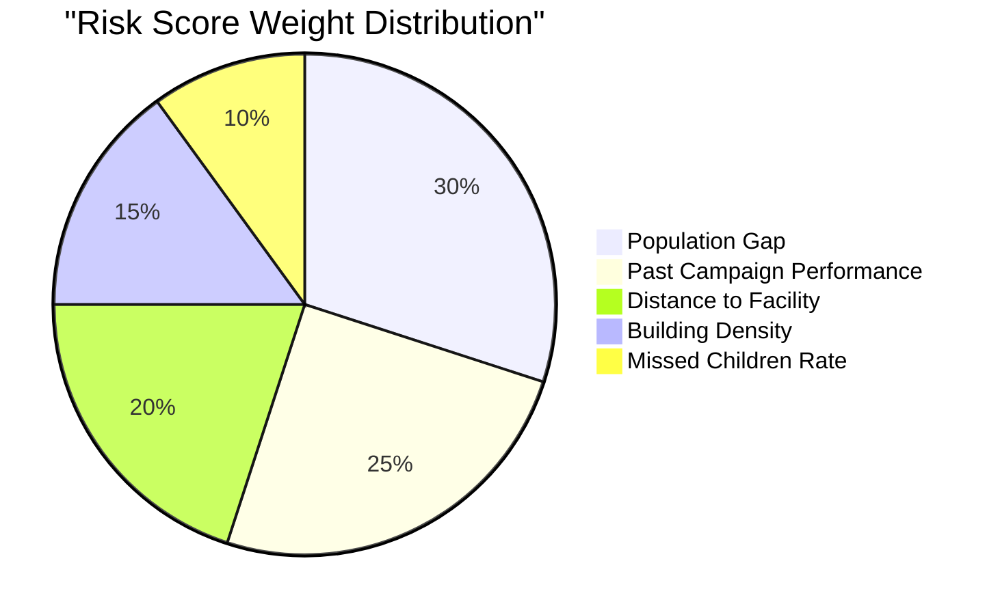

---

## 6. Part 2: Beneficiary Deduplication Engine

### 6.1 System Architecture

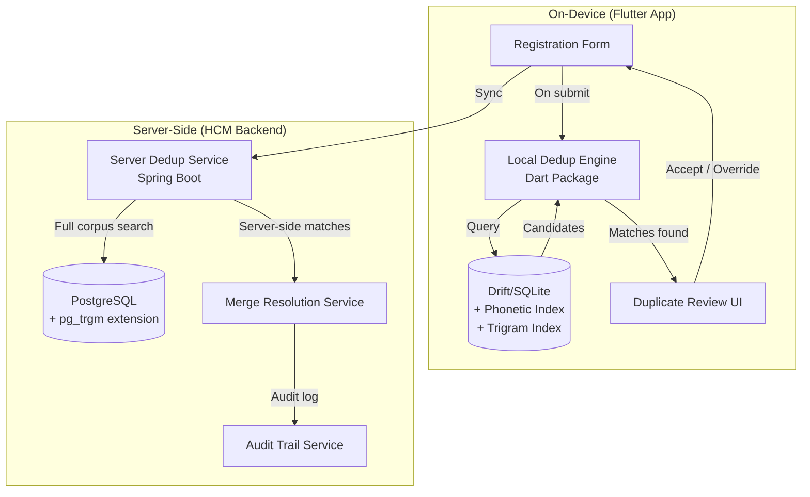

### 6.2 Dual-Layer Deduplication Strategy

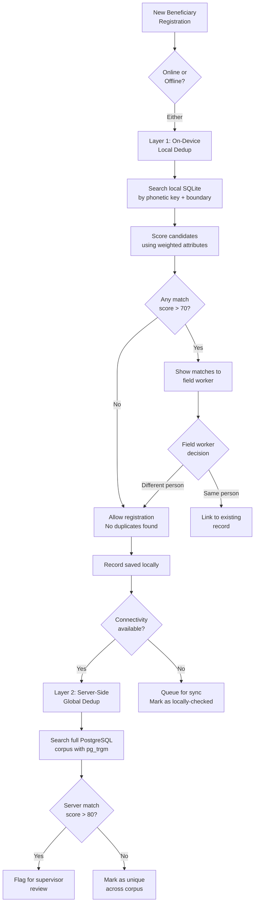

### 6.3 Feature 1: Fuzzy Search Engine

**Multi-Algorithm Matching Pipeline:**

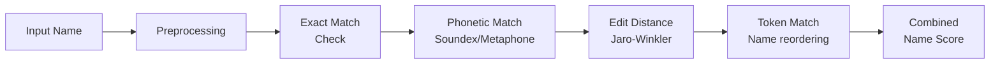

**Algorithm Selection and Rationale:**

| Algorithm | Use Case | Why Selected |
|-----------|----------|-------------|
| **Jaro-Winkler** | Primary name similarity | Optimized for short strings and person names; gives prefix bonus matching real-world typo patterns |
| **Soundex (adapted)** | Phonetic blocking | Groups phonetically similar names to reduce search space; O(1) lookup via index |
| **Double Metaphone** | Cross-language phonetics | Handles transliteration variants (Rahim/Raheem) better than Soundex alone |
| **Levenshtein** | Fallback / secondary scoring | Edit distance for names that sound different but are typo variants |
| **Token Set Ratio** | Multi-part name comparison | Handles name reordering ("Mohammed Ali" vs "Ali Mohammed") |

**Dart Implementation Approach:**

```dart
class NameMatcher {
  /// Returns similarity score 0.0 - 1.0
  double computeNameSimilarity(String name1, String name2) {
    final n1 = _preprocess(name1);
    final n2 = _preprocess(name2);

    // Exact match short-circuit
    if (n1 == n2) return 1.0;

    // Weighted combination of algorithms
    final jaroWinkler = _jaroWinklerSimilarity(n1, n2);       // weight: 0.40
    final phoneticMatch = _phoneticSimilarity(n1, n2);         // weight: 0.30
    final tokenSetRatio = _tokenSetSimilarity(n1, n2);         // weight: 0.30

    return (0.40 * jaroWinkler) + (0.30 * phoneticMatch) + (0.30 * tokenSetRatio);
  }

  String _preprocess(String name) {
    return name
        .trim()
        .toLowerCase()
        .replaceAll(RegExp(r'[^\w\s]'), '')  // remove punctuation
        .replaceAll(RegExp(r'\s+'), ' ');     // normalize whitespace
  }
}
```

### 6.4 Feature 2: Similarity Scoring Engine

**Weighted Multi-Attribute Scoring:**

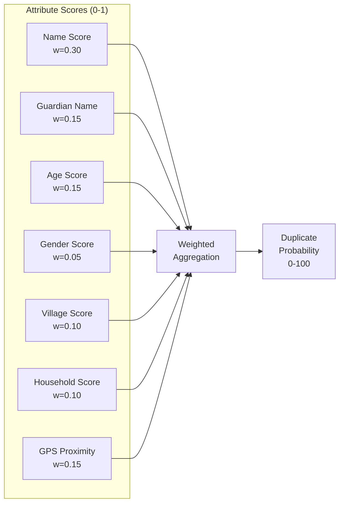

**Scoring Rules:**

```
FUNCTION computeDuplicateProbability(candidate, existing):
    scores = {}

    // Name: Jaro-Winkler + Phonetic ensemble
    scores.name = nameMatcher.computeNameSimilarity(
        candidate.name, existing.name)                          // weight: 0.30

    // Guardian: Same matcher, allows for spouse/parent variations
    scores.guardian = nameMatcher.computeNameSimilarity(
        candidate.guardianName, existing.guardianName)          // weight: 0.15

    // Age: Gaussian tolerance (±2 years = full match)
    ageDiff = abs(candidate.age - existing.age)
    scores.age = exp(-(ageDiff^2) / (2 * 2^2))                 // weight: 0.15

    // Gender: Binary match
    scores.gender = candidate.gender == existing.gender ? 1.0 : 0.0  // weight: 0.05

    // Village: Exact string match on normalized village name
    scores.village = normalizedMatch(
        candidate.village, existing.village) ? 1.0 : 0.0       // weight: 0.10

    // Household: Match on household ID or head-of-household name
    scores.household = householdMatch(
        candidate.householdRef, existing.householdRef)          // weight: 0.10

    // GPS: Haversine distance, full score within 50m, decay to 0 at 500m
    distance = haversineDistance(candidate.gps, existing.gps)
    scores.gps = max(0, 1 - (distance / 500))                  // weight: 0.15

    probability = round(100 * (
        0.30 * scores.name +
        0.15 * scores.guardian +
        0.15 * scores.age +
        0.05 * scores.gender +
        0.10 * scores.village +
        0.10 * scores.household +
        0.15 * scores.gps
    ))

    RETURN { probability, attributeScores: scores }
```

**Thresholds:**

| Probability | Classification | Action |
|-------------|---------------|--------|
| >= 90 | Near-certain duplicate | Auto-suggest link, require override to create new |
| 70 - 89 | Likely duplicate | Show match card, field worker decides |
| 50 - 69 | Possible duplicate | Subtle indicator, no blocking |
| < 50 | Unlikely duplicate | No action |

### 6.5 Feature 3: Flutter SDK (Reusable Package)

**Package Structure:**

```
digit_dedup_engine/
├── lib/
│   ├── digit_dedup_engine.dart           # Public API barrel file
│   ├── src/
│   │   ├── engine/
│   │   │   ├── dedup_engine.dart          # Main entry point
│   │   │   ├── candidate_search.dart      # Candidate retrieval
│   │   │   └── match_scorer.dart          # Weighted scoring
│   │   ├── matchers/
│   │   │   ├── jaro_winkler.dart          # Jaro-Winkler implementation
│   │   │   ├── soundex.dart               # Soundex phonetic encoder
│   │   │   ├── double_metaphone.dart      # Double Metaphone encoder
│   │   │   ├── levenshtein.dart           # Levenshtein distance
│   │   │   └── token_set.dart             # Token set ratio
│   │   ├── models/
│   │   │   ├── beneficiary_record.dart    # Input record model
│   │   │   ├── match_result.dart          # Output match model
│   │   │   └── dedup_config.dart          # Configurable weights/thresholds
│   │   ├── indexing/
│   │   │   ├── phonetic_index.dart        # Phonetic key generation
│   │   │   └── blocking_strategy.dart     # Search space reduction
│   │   ├── persistence/
│   │   │   ├── dedup_dao.dart             # Data access layer
│   │   │   └── drift_tables.dart          # Drift table definitions
│   │   └── geo/
│   │       └── haversine.dart             # GPS distance calculation
│   └── widgets/
│       ├── match_review_card.dart         # UI widget for match display
│       └── duplicate_banner.dart          # Inline warning banner
├── test/
│   ├── matchers/                          # Unit tests for each matcher
│   ├── engine/                            # Integration tests
│   └── fixtures/                          # Test data
└── pubspec.yaml
```

**Public API:**

```dart
/// Main entry point for the deduplication engine.
class DedupEngine {
  final DedupConfig config;
  final DedupDao _dao;

  DedupEngine({required this.config, required DedupDao dao}) : _dao = dao;

  /// Find potential duplicate matches for a beneficiary record.
  /// Returns matches sorted by probability (highest first).
  Future<List<MatchResult>> findMatches(
    BeneficiaryRecord candidate, {
    int maxResults = 5,
    double minProbability = 50.0,
  }) async {
    // Step 1: Generate blocking keys
    final phoneticKeys = PhoneticIndex.generateKeys(candidate.name);

    // Step 2: Retrieve candidates from local DB using blocking
    final candidates = await _dao.findCandidates(
      phoneticKeys: phoneticKeys,
      boundaryCode: candidate.boundaryCode,
      gender: candidate.gender,
    );

    // Step 3: Score each candidate
    final results = candidates
        .map((existing) => MatchScorer.score(candidate, existing, config))
        .where((result) => result.probability >= minProbability)
        .toList()
      ..sort((a, b) => b.probability.compareTo(a.probability));

    return results.take(maxResults).toList();
  }

  /// Index a new record for future matching.
  Future<void> indexRecord(BeneficiaryRecord record) async {
    final phoneticKeys = PhoneticIndex.generateKeys(record.name);
    await _dao.insertWithIndex(record, phoneticKeys);
  }
}
```

### 6.6 Feature 4: Offline-First Operation

**Recommended: Drift (SQLite)**

| Criteria | Drift | Isar | Hive |
|----------|-------|------|------|
| DIGIT HCM compatibility | Already in use | Would add second DB engine | Not relational |
| SQL query support | Full SQL | No (NoSQL) | No (key-value) |
| Trigram/LIKE queries | Yes (SQLite FTS5) | Built-in full-text | No |
| Index support | B-tree, FTS5 | Composite indexes | Limited |
| Maturity | Stable, well-maintained | Discontinued (no v4) | Stable but limited |
| Data volume | Handles millions of rows | Handles millions | Slows at 100k+ |

**Recommendation: Drift** — It aligns with the existing HCM Flutter app stack, supports the SQL queries needed for candidate retrieval, and avoids introducing a second database engine.

**Local Index Schema (Drift/SQLite):**

```sql
-- Beneficiary records for dedup matching
CREATE TABLE dedup_beneficiary (
    client_reference_id TEXT PRIMARY KEY,
    given_name TEXT NOT NULL,
    family_name TEXT,
    guardian_name TEXT,
    age INTEGER,
    gender TEXT,
    boundary_code TEXT NOT NULL,
    household_client_id TEXT,
    latitude REAL,
    longitude REAL,
    soundex_given TEXT,       -- Pre-computed Soundex key
    soundex_family TEXT,      -- Pre-computed Soundex key
    metaphone_given TEXT,     -- Pre-computed Double Metaphone key
    synced INTEGER DEFAULT 0,
    created_at INTEGER NOT NULL
);

-- Phonetic blocking index for fast candidate retrieval
CREATE INDEX idx_dedup_phonetic
    ON dedup_beneficiary(soundex_given, boundary_code, gender);

CREATE INDEX idx_dedup_boundary
    ON dedup_beneficiary(boundary_code);

-- Enable FTS5 for advanced text search (optional, for name search)
CREATE VIRTUAL TABLE dedup_fts USING fts5(
    given_name, family_name, guardian_name,
    content=dedup_beneficiary,
    content_rowid=rowid
);
```

### 6.7 Feature 5: AI-Assisted Matching

**Approach: Probabilistic Record Linkage with optional lightweight ML**

For the core engine, the weighted scoring model described in 6.4 is a form of probabilistic record linkage based on the Fellegi-Sunter model. This provides high explainability and works on any device.

**Future ML Enhancement Path:**

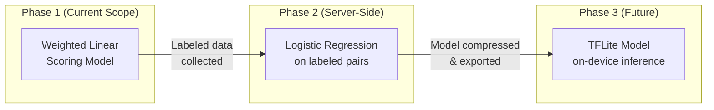

**Phase 1 — Weighted Scoring (Current Scope):**
- Fellegi-Sunter probabilistic model with configurable weights
- Phonetic blocking for search space reduction
- No ML runtime dependency
- Works on any Android 5.0+ device

**Phase 2 — Server-Side Logistic Regression (Post-launch):**
- Train on field worker accept/reject decisions as labels
- Features: all attribute similarity scores from Phase 1
- Deploy as server-side batch dedup on synced data
- Scikit-learn or similar; runs on backend only

**Phase 3 — On-Device TFLite (Future):**
- Export trained logistic regression to TensorFlow Lite
- ~10KB model file, sub-millisecond inference
- Replace weighted linear scoring on capable devices
- Fallback to Phase 1 on incompatible devices

### 6.8 Feature 6: MOSIP Integration Study

**MOSIP Overview:**
MOSIP (Modular Open Source Identity Platform) is an open-source national ID platform deployed in 13+ countries. It provides biometric deduplication via an Automated Biometric Identification System (ABIS) interface.

**Integration Feasibility Assessment:**

| Dimension | Assessment |
|-----------|-----------|
| **Technical Compatibility** | MOSIP uses REST APIs + message queues (ActiveMQ). HCM backend can integrate via REST. |
| **Biometric Dedup** | MOSIP ABIS does 1:N biometric dedup. HCM does not collect biometrics today. Not applicable for current scope. |
| **Demographic Dedup** | MOSIP's demographic dedup is tightly coupled to its registration pipeline. Not easily extracted as standalone. |
| **ID Verification** | If beneficiaries have MOSIP-issued national IDs, HCM could verify identity via MOSIP's ID Authentication API (1:1 match). |
| **Offline Operation** | MOSIP requires connectivity for all operations. Does not support offline dedup. |
| **Deployment Context** | MOSIP is deployed in some African countries where HCM operates (e.g., Ethiopia, Morocco). Overlap exists. |

**Recommended Integration Architecture (Future):**

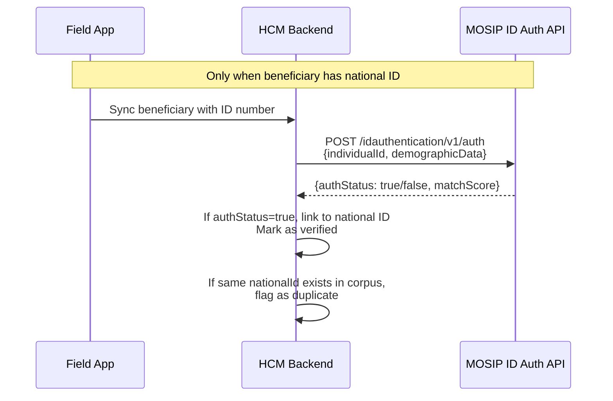

**Limitations:**
- Only works for beneficiaries with national IDs (many children under 5 do not have IDs)
- Requires connectivity to MOSIP servers
- MOSIP deployment varies by country
- Does not replace on-device dedup for offline scenarios

**Recommendation:** Treat MOSIP integration as an optional enrichment layer. The primary dedup engine must work without MOSIP. When a national ID is available and connectivity exists, use MOSIP ID Auth as a high-confidence verification signal.

---

## 7. Recommended Technology Stack

### 7.1 Backend Services

> **Key Decision:** All HCM backend services are Java Spring Boot. The PDI API service
> must follow this convention. Python is used **only** for batch pre-computation jobs
> (raster processing, DBSCAN clustering) that write results into PostGIS. The Java
> service reads from these pre-computed tables — no raster math at API request time.

| Component | Technology | Justification |
|-----------|-----------|---------------|
| **Population Intelligence API Service** | Java Spring Boot + Hibernate Spatial | **Must align with HCM backend stack** — uses same API gateway, auth, Kafka patterns |
| **PDI Batch Pre-Computation Jobs** | Python (rasterio, geopandas, scikit-learn) | Raster zonal stats and DBSCAN have no Java equivalents of comparable quality; these are offline batch jobs that write to PostGIS |
| **Dedup Service (Server)** | Java Spring Boot | Aligns with existing HCM microservice stack |
| **Geospatial Database** | PostgreSQL 15 + PostGIS 3.4 | Already in DIGIT stack; PostGIS is industry standard |
| **Building Footprint Queries** | PostGIS spatial queries (read by Java via Hibernate Spatial) | ST_Within, ST_Intersects on indexed building polygons |
| **Vector Tile Server** | pg_tileserv or Martin | Serve MVT tiles directly from PostGIS for map visualization |
| **Cache** | Redis | Pre-computed settlement summaries; already in DIGIT stack |
| **Message Queue** | Apache Kafka | Already in DIGIT stack; event-driven processing |
| **Search** | ElasticSearch | Already in DIGIT stack; server-side fuzzy name search |

**Architecture Split — Why Java + Python Coexist:**

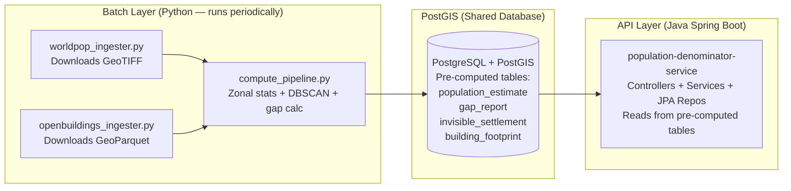

### 7.2 Mobile / Flutter

| Component | Technology | Justification |
|-----------|-----------|---------------|
| **Local Database** | Drift (SQLite) | Already used in HCM Flutter app |
| **State Management** | BLoC | Already used in HCM Flutter app |
| **Map Widget** | flutter_map + vector_map_tiles | Open-source, supports offline MBTiles |
| **Offline Tile Cache** | MBTiles (pre-downloaded) | Standard format for offline map tiles |
| **Dedup Engine** | Pure Dart package | No native dependencies; runs on any Flutter target |
| **Code Generation** | dart_mappable, drift_dev, build_runner | Consistent with HCM patterns |

### 7.3 AI/ML

| Component | Technology | Justification |
|-----------|-----------|---------------|
| **Spatial Clustering** | DBSCAN (scikit-learn) | Settlement detection from building clusters |
| **Risk Scoring** | Weighted linear model (configurable) | Explainable; no training data needed initially |
| **Future Dedup ML** | Logistic Regression → TFLite | Incremental path; collects training data first |
| **Raster Analysis** | rasterio, rasterstats | Standard Python geospatial stack |
| **Geospatial Analysis** | geopandas, shapely, pyproj | Industry standard for vector operations |

### 7.4 Infrastructure

| Component | Technology | Justification |
|-----------|-----------|---------------|
| **Containerization** | Docker | DIGIT standard |
| **Orchestration** | Kubernetes (Helm charts) | DIGIT standard |
| **CI/CD** | GitHub Actions | DIGIT standard |
| **Monitoring** | Prometheus + Grafana | DIGIT standard |

---

## 8. API Contracts

### 8.1 Population Intelligence APIs

#### POST /population/v1/estimate

Estimate population for a settlement polygon.

**Request:**
```json
{
  "RequestInfo": { "apiId": "pdi", "ver": "1.0", "ts": "2026-06-10T12:00:00Z" },
  "settlementBoundary": {
    "type": "Feature",
    "geometry": {
      "type": "Polygon",
      "coordinates": [[[35.1, -1.2], [35.2, -1.2], [35.2, -1.1], [35.1, -1.1], [35.1, -1.2]]]
    },
    "properties": {
      "boundaryCode": "VILLAGE-042",
      "boundaryType": "VILLAGE"
    }
  },
  "options": {
    "includeBuildings": true,
    "confidenceThreshold": 0.70
  }
}
```

**Response:**
```json
{
  "ResponseInfo": { "apiId": "pdi", "ver": "1.0", "ts": "2026-06-10T12:00:01Z", "status": "successful" },
  "populationEstimate": {
    "estimatedPopulation": 1200,
    "estimatedHouseholds": 240,
    "buildingCount": 252,
    "confidence": 0.89,
    "method": "worldpop_openbuildings_ensemble",
    "areaKm2": 2.4,
    "populationDensity": 500.0,
    "dataVersions": {
      "worldPop": "2023-unconstrained-100m",
      "openBuildings": "v3-2023-05"
    }
  }
}
```

#### POST /population/v1/gap/_search

Retrieve gap analysis for settlements within a campaign.

**Request:**
```json
{
  "RequestInfo": { "apiId": "pdi", "ver": "1.0" },
  "gapSearchCriteria": {
    "campaignId": "CAMP-2026-MALARIA-01",
    "boundaryCode": "DISTRICT-005",
    "boundaryType": "DISTRICT",
    "gapClassification": ["RED", "YELLOW"],
    "limit": 50,
    "offset": 0,
    "sortBy": "coverageRatio",
    "sortOrder": "ASC"
  }
}
```

**Response:**
```json
{
  "ResponseInfo": { "apiId": "pdi", "ver": "1.0", "status": "successful" },
  "gapReports": [
    {
      "settlementId": "SET-001",
      "boundaryCode": "VILLAGE-042",
      "estimatedPopulation": 1200,
      "registeredPopulation": 380,
      "populationGap": 820,
      "estimatedHouseholds": 240,
      "registeredHouseholds": 85,
      "householdGap": 155,
      "coverageRatio": 0.317,
      "gapClassification": "RED",
      "riskScore": 82,
      "riskPriority": "CRITICAL"
    }
  ],
  "totalCount": 23,
  "pagination": { "limit": 50, "offset": 0 }
}
```

#### GET /population/v1/settlements/invisible

Retrieve unregistered settlements detected from building footprints.

**Response:**
```json
{
  "ResponseInfo": { "apiId": "pdi", "ver": "1.0", "status": "successful" },
  "invisibleSettlements": [
    {
      "clusterId": "CLUSTER-2026-0042",
      "centroid": { "latitude": -1.156, "longitude": 35.187 },
      "buildingCount": 18,
      "estimatedPopulation": 90,
      "nearestRegisteredSettlement": "VILLAGE-041",
      "distanceToNearestKm": 3.2,
      "detectedAt": "2026-06-09T02:00:00Z",
      "parentBoundaryCode": "DISTRICT-005",
      "status": "UNVERIFIED"
    }
  ]
}
```

#### POST /population/v1/risk/_search

Search settlements by risk score.

**Request:**
```json
{
  "RequestInfo": { "apiId": "pdi", "ver": "1.0" },
  "riskSearchCriteria": {
    "campaignId": "CAMP-2026-MALARIA-01",
    "boundaryCode": "DISTRICT-005",
    "minRiskScore": 50,
    "riskPriority": ["CRITICAL", "HIGH"],
    "limit": 20,
    "offset": 0
  }
}
```

### 8.2 Deduplication APIs (Server-Side)

#### POST /dedup/v1/_search

Search for potential duplicates of a beneficiary (server-side, post-sync).

**Request:**
```json
{
  "RequestInfo": { "apiId": "dedup", "ver": "1.0" },
  "beneficiary": {
    "givenName": "Rahim",
    "familyName": "Hassan",
    "guardianName": "Fatima Hassan",
    "age": 5,
    "gender": "MALE",
    "boundaryCode": "VILLAGE-042",
    "householdClientId": "HH-CLT-001",
    "location": { "latitude": -1.156, "longitude": 35.187 }
  },
  "options": {
    "minProbability": 50,
    "maxResults": 5
  }
}
```

**Response:**
```json
{
  "ResponseInfo": { "apiId": "dedup", "ver": "1.0", "status": "successful" },
  "matches": [
    {
      "matchedBeneficiaryId": "IND-SERVER-0042",
      "matchedClientReferenceId": "CLT-REF-8827",
      "duplicateProbability": 92,
      "attributeScores": {
        "name": 0.95,
        "guardian": 0.88,
        "age": 1.0,
        "gender": 1.0,
        "village": 1.0,
        "household": 0.80,
        "gps": 0.72
      },
      "matchedRecord": {
        "givenName": "Raheem",
        "familyName": "Hassan",
        "guardianName": "Fatima Hasan",
        "age": 5,
        "gender": "MALE"
      }
    }
  ]
}
```

#### POST /dedup/v1/merge

Merge two beneficiary records identified as duplicates.

**Request:**
```json
{
  "RequestInfo": { "apiId": "dedup", "ver": "1.0" },
  "mergeRequest": {
    "primaryBeneficiaryId": "IND-SERVER-0042",
    "duplicateBeneficiaryId": "IND-SERVER-0099",
    "mergedBy": "SUPERVISOR-001",
    "mergeReason": "DUPLICATE_CONFIRMED",
    "retainFields": {
      "name": "PRIMARY",
      "age": "PRIMARY",
      "guardian": "DUPLICATE",
      "mobileNumber": "DUPLICATE"
    }
  }
}
```

#### GET /dedup/v1/stats

Deduplication statistics for a campaign.

**Response:**
```json
{
  "ResponseInfo": { "apiId": "dedup", "ver": "1.0", "status": "successful" },
  "stats": {
    "campaignId": "CAMP-2026-MALARIA-01",
    "totalBeneficiaries": 45200,
    "duplicatesDetected": 3840,
    "duplicatesConfirmed": 2190,
    "duplicatesRejected": 1650,
    "duplicateRate": 0.085,
    "avgMatchScore": 78.3,
    "topDuplicateBoundaries": [
      { "boundaryCode": "VILLAGE-042", "duplicateCount": 145 },
      { "boundaryCode": "VILLAGE-018", "duplicateCount": 112 }
    ]
  }
}
```

---

## 9. Database Schema

### 9.1 Population Intelligence Schema (PostGIS)

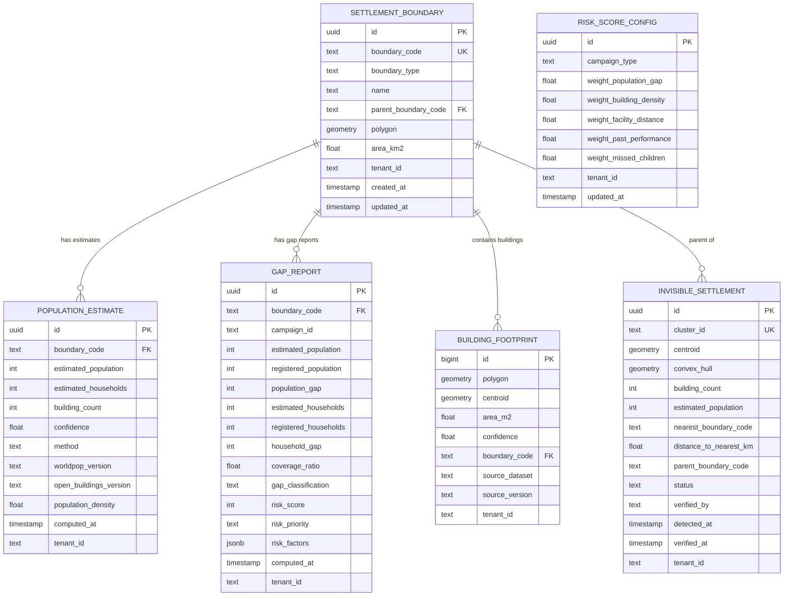

### 9.2 Deduplication Schema (Server - PostgreSQL)

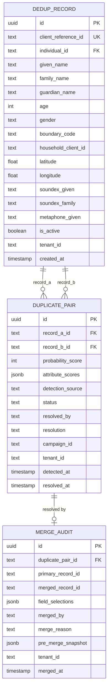

### 9.3 Key Indexes

```sql
-- PostGIS spatial indexes
CREATE INDEX idx_building_footprint_geom ON building_footprint USING GIST(polygon);
CREATE INDEX idx_building_footprint_centroid ON building_footprint USING GIST(centroid);
CREATE INDEX idx_settlement_boundary_geom ON settlement_boundary USING GIST(polygon);
CREATE INDEX idx_invisible_settlement_centroid ON invisible_settlement USING GIST(centroid);

-- Dedup indexes
CREATE EXTENSION IF NOT EXISTS pg_trgm;
CREATE INDEX idx_dedup_name_trgm ON dedup_record USING GIN(given_name gin_trgm_ops);
CREATE INDEX idx_dedup_soundex ON dedup_record(soundex_given, boundary_code, gender);
CREATE INDEX idx_dedup_boundary ON dedup_record(boundary_code, is_active);

-- Gap report indexes
CREATE INDEX idx_gap_campaign ON gap_report(campaign_id, gap_classification);
CREATE INDEX idx_gap_risk ON gap_report(campaign_id, risk_score DESC);
```

---

## 10. GIS Architecture

### 10.1 Geospatial Data Pipeline

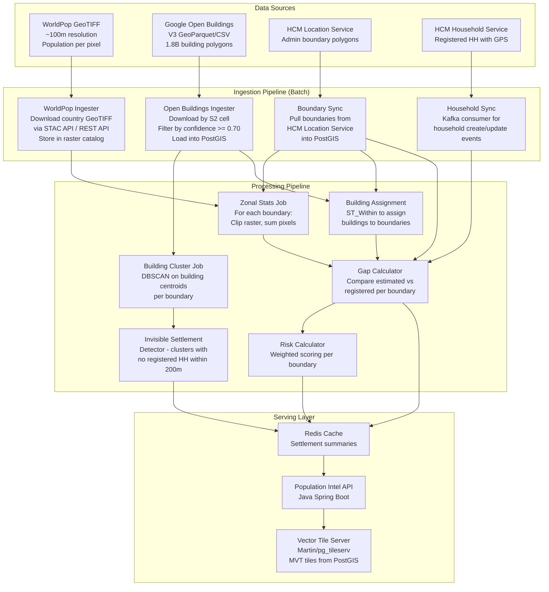

### 10.2 Raster Processing Detail

**WorldPop Data Access:**
- **Source:** WorldPop STAC API (`https://stac.worldpop.org/`) or REST API (`https://www.worldpop.org/rest/data`)
- **Format:** GeoTIFF, ~100m resolution, WGS84
- **Unit:** People per pixel (fractional)
- **Coverage:** Country-level files, updated yearly

**Processing Steps:**
1. Download country-level constrained/unconstrained population raster
2. Store in PostGIS raster catalog (`raster2pgsql` or `rasterio` to load)
3. For each settlement boundary, compute zonal statistics:
   - `ST_SummaryStats(ST_Clip(raster, boundary))` → sum = estimated population
4. Cache results; recompute when boundary changes or new raster version available

### 10.3 Building Footprint Processing

**Google Open Buildings Access:**
- **Source:** GeoParquet files partitioned by S2 cell, or `get_buildings` CLI tool
- **Format:** CSV/GeoParquet with lat, lon, polygon (WKT), confidence, area_m2
- **Confidence Filter:** >= 0.70 (balances precision and recall)

**Processing Steps:**
1. Download building data for campaign country/region using S2 cell index
2. Filter by confidence threshold (configurable, default 0.70)
3. Load into PostGIS `building_footprint` table with spatial index
4. Assign buildings to settlement boundaries: `ST_Within(building.centroid, boundary.polygon)`
5. Count buildings per boundary → estimated households

### 10.4 Offline Map Architecture (Mobile)

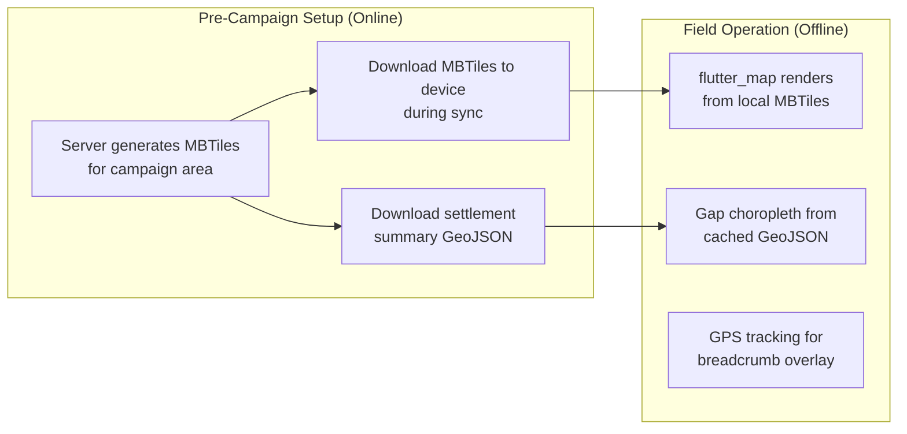

**MBTiles Generation:**
- Pre-render OSM base tiles + boundary overlays for campaign area at zoom levels 8-16
- Typical size: 50-200 MB per district (manageable for modern Android devices)
- Include gap choropleth as a tile layer or GeoJSON overlay
- Downloaded during campaign setup phase when device has connectivity

---

## 11. AI/ML Architecture

### 11.1 ML Components Overview

```mermaid
graph TB
    subgraph "Population Intelligence ML"
        A[Population Estimation<br/>Ensemble Model]
        B[Invisible Settlement<br/>Detection - DBSCAN]
        C[Risk Scoring<br/>Weighted Linear → future GB]
    end

    subgraph "Deduplication ML"
        D[Phonetic Encoding<br/>Soundex + Metaphone]
        E[String Similarity<br/>Jaro-Winkler + Token Set]
        F[Probabilistic Record<br/>Linkage - Fellegi-Sunter]
        G[Future: Logistic Regression<br/>→ TFLite on-device]
    end

    subgraph "Shared Infrastructure"
        H[Feature Store<br/>Pre-computed scores in Redis]
        I[Model Registry<br/>Version tracking]
        J[Evaluation Framework<br/>Precision/Recall/F1]
    end

    A --> H
    B --> H
    C --> H & I
    F --> H
    G --> I & J
```

### 11.2 Population Estimation Model

**Type:** Ensemble of two estimation methods (not a trained ML model)

| Method | Source | Technique | Strengths |
|--------|--------|-----------|-----------|
| WorldPop Zonal Stats | Population raster | Clip + sum pixel values | Covers all areas, calibrated to census |
| Building-Count Extrapolation | Open Buildings | Count × avg HH size | Ground-truth proxy for settlements |

**Ensemble Strategy:**
- When methods agree (divergence < 30%): weighted average (60% WorldPop, 40% Building)
- When methods diverge: use WorldPop as primary, flag for human review
- Confidence score reflects method agreement

**Evaluation:**
- Compare estimates against actual registration data from completed campaigns
- Metric: Mean Absolute Percentage Error (MAPE) of estimates vs. actual populations registered
- Target: MAPE < 25% for settlements with > 100 people

### 11.3 Settlement Detection Model

**Type:** DBSCAN Spatial Clustering

**Parameters:**
- `eps` = 100m (buildings within 100m belong to same cluster)
- `min_samples` = 3 (minimum 3 buildings to form a settlement cluster)

**Pipeline:**
1. Extract building centroids from Open Buildings within campaign area
2. Run DBSCAN clustering
3. For each cluster, compute convex hull → settlement polygon
4. Cross-reference with registered household GPS points (200m buffer)
5. Clusters with no household matches → invisible settlements

**Evaluation:**
- True Positive: Cluster corresponds to a real, unregistered settlement (verified by field visit)
- False Positive: Cluster is a non-residential area (e.g., market, school)
- Target precision: > 70% (to avoid alert fatigue)

### 11.4 Risk Scoring Model

**Phase 1: Explainable Weighted Model**
- 5 features with configurable weights (see Section 5.6)
- No training required; weights set by domain experts
- Fully transparent: each factor's contribution visible in output

**Phase 2: Gradient Boosted Model (when labeled data available)**
- Training data: settlement features → actual coverage outcome
- Model: XGBoost or LightGBM
- Features: same 5 factors + additional (terrain, road density, season)
- Label: actual coverage ratio achieved post-campaign
- Evaluation: RMSE of predicted vs. actual coverage ratio

### 11.5 Deduplication Model

**Phase 1: Probabilistic Record Linkage**

Based on Fellegi-Sunter framework:
- **m-probability:** P(attribute agrees | records are a match)
- **u-probability:** P(attribute agrees | records are not a match)
- **Weight:** log2(m/u) for agreement, log2((1-m)/(1-u)) for disagreement

For initial deployment, the simplified weighted scoring (Section 6.4) is equivalent and more intuitive for field implementation.

**Blocking Strategy (Search Space Reduction):**

| Blocking Key | Purpose | Reduction Factor |
|-------------|---------|------------------|
| Soundex(givenName) | Phonetic grouping | ~90% reduction |
| boundaryCode | Geographic locality | ~95% reduction |
| gender | Binary filter | ~50% reduction |
| Combined | All three | ~99.5% reduction |

For a village of 500 beneficiaries, the combined blocking key typically produces 2-5 candidates per query instead of 500.

**Evaluation Metrics:**

| Metric | Target | Description |
|--------|--------|-------------|
| Precision | > 85% | Of flagged duplicates, % that are actual duplicates |
| Recall | > 75% | Of actual duplicates, % that are detected |
| F1 Score | > 0.80 | Harmonic mean of precision and recall |
| Latency (on-device) | < 200ms | Time to search and score, per registration |

### 11.6 Training Data Strategy

Neither system requires training data for Phase 1 deployment. Training data accumulates organically:

| Data Source | Used For | How Collected |
|-------------|----------|---------------|
| Field worker accept/reject of dedup suggestions | Dedup model training | Logged automatically on device |
| Supervisor merge/reject decisions | Dedup model validation | Logged in merge audit table |
| Post-campaign actual coverage vs. estimates | Risk model training | Computed from HCM campaign data |
| Field verification of invisible settlements | Settlement detection tuning | Logged by supervisors visiting flagged sites |

---

## 12. Flutter Package Architecture

### 12.1 Package Dependency Graph

```mermaid
graph TB
    subgraph "New Packages (to build)"
        DEDUP[digit_dedup_engine<br/>Core dedup logic<br/>Pure Dart]
        PDI_CLIENT[digit_pdi_client<br/>Population Intel API client<br/>+ offline cache]
        GIS_WIDGET[digit_gis_widgets<br/>Map components<br/>+ gap visualization]
    end

    subgraph "Existing HCM Packages (dependencies)"
        DATA_MODEL[digit_data_model<br/>Entity models + Drift]
        SYNC[digit_sync_service<br/>Offline sync engine]
        AUTH[digit_auth<br/>Authentication]
        BLOC_LIB[BLoC / flutter_bloc<br/>State management]
    end

    subgraph "External Dependencies"
        DRIFT[Drift<br/>SQLite ORM]
        FLUTTER_MAP[flutter_map<br/>Map rendering]
        MBTILES[mbtiles<br/>Offline tiles]
        DIO[dio<br/>HTTP client]
    end

    DEDUP --> DATA_MODEL
    DEDUP --> DRIFT
    PDI_CLIENT --> DIO
    PDI_CLIENT --> DATA_MODEL
    PDI_CLIENT --> AUTH
    GIS_WIDGET --> FLUTTER_MAP
    GIS_WIDGET --> MBTILES
    GIS_WIDGET --> PDI_CLIENT

    DATA_MODEL --> DRIFT
    SYNC --> DRIFT
```

### 12.2 digit_dedup_engine Package

**Responsibilities:**
- Fuzzy name matching (Jaro-Winkler, Soundex, Double Metaphone, Token Set)
- Multi-attribute weighted scoring
- Phonetic index management in Drift/SQLite
- Candidate retrieval with blocking strategy
- Match result ranking

**Key Design Decisions:**
- **Pure Dart:** No platform-specific code. Runs on Android, iOS, web, desktop.
- **No ML runtime dependency:** All matching is algorithmic. No TFLite, no ONNX.
- **Configurable:** Weights, thresholds, and algorithms configurable via `DedupConfig` object, loadable from MDMS.
- **Testable:** All matchers have deterministic output. Extensive unit test fixtures.

**Integration with HCM App:**

```dart
// In HCM registration BLoC
class BeneficiaryRegistrationBloc extends Bloc<RegEvent, RegState> {
  final DedupEngine _dedupEngine;

  Future<void> _onBeneficiarySubmitted(
    BeneficiarySubmitted event,
    Emitter<RegState> emit,
  ) async {
    // Check for duplicates before saving
    final matches = await _dedupEngine.findMatches(
      event.beneficiary,
      minProbability: 70.0,
    );

    if (matches.isNotEmpty) {
      emit(DuplicatesFound(matches: matches, original: event.beneficiary));
    } else {
      // No duplicates, proceed with registration
      await _dedupEngine.indexRecord(event.beneficiary);
      emit(RegistrationSuccess());
    }
  }
}
```

### 12.3 digit_pdi_client Package

**Responsibilities:**
- HTTP client for Population Intelligence API
- Offline caching of settlement summaries
- Periodic sync of gap reports during connectivity windows
- Provides data to GIS widgets

**Offline Strategy:**
- During campaign setup (online), download all settlement summaries for assigned boundaries
- Store in local Drift database
- Settlement summaries include: estimated population, registered population, gap classification, risk score
- Refresh on each sync cycle

### 12.4 digit_gis_widgets Package

**Responsibilities:**
- `GapChoroplethMap`: Full-screen map with color-coded settlement boundaries
- `SettlementSummaryCard`: Bottom sheet showing population/gap stats for tapped settlement
- `InvisibleSettlementMarker`: Animated marker for unregistered settlements
- `CoverageProgressBar`: Visual coverage indicator (estimated vs. registered)

**Offline Map Support:**
- Pre-downloaded MBTiles for base map
- GeoJSON overlay for settlement boundaries + gap colors
- Works fully offline once tiles are downloaded

### 12.5 State Management (BLoC Pattern)

```mermaid
graph LR
    subgraph "Dedup BLoCs"
        DB1[DedupSearchBloc<br/>Handles match search on submit]
        DB2[DedupReviewBloc<br/>Handles accept/reject/override]
    end

    subgraph "PDI BLoCs"
        PB1[SettlementListBloc<br/>Fetches gap reports for area]
        PB2[GapMapBloc<br/>Manages map state and layers]
        PB3[RiskDashboardBloc<br/>Fetches risk-sorted settlements]
    end

    DB1 --> DB2
    PB1 --> PB2
```

---

## 13. Offline Deduplication — Detailed Flow

This section documents exactly how the dedup engine operates within the existing HCM Flutter app without any network connectivity.

### 13.1 Current HCM Registration Flow (No Dedup — What Exists Today)

```mermaid
sequenceDiagram
    participant FW as Field Worker
    participant UI as Registration Screen
    participant BLOC as Registration BLoC
    participant DRIFT as Drift/SQLite
    participant QUEUE as Sync Queue

    FW->>UI: Opens "Register Individual" form
    UI->>FW: Shows name, age, gender, guardian fields
    FW->>UI: Fills form, taps Submit
    UI->>BLOC: BeneficiarySubmitEvent
    BLOC->>DRIFT: INSERT individual record<br/>(clientReferenceId generated on device)
    DRIFT-->>BLOC: Saved
    BLOC->>QUEUE: Add to pending sync operations
    BLOC->>UI: Show success, move to next
```

**The gap:** No duplicate check happens between form submission and database insert. If "Rahim, Age 5, Male, Village X" already exists in the local DB from a prior registration or sync-down, the system silently creates a second record.

### 13.2 New Flow WITH Deduplication Engine

```mermaid
sequenceDiagram
    participant FW as Field Worker
    participant UI as Registration Screen
    participant BLOC as Registration BLoC
    participant DEDUP as DedupEngine (Pure Dart)
    participant IDX as Phonetic Index (SQLite table)
    participant DRIFT as Drift/SQLite
    participant REVIEW as Duplicate Review Bottom Sheet
    participant QUEUE as Sync Queue

    FW->>UI: Opens "Register Individual" form
    FW->>UI: Fills form, taps Submit
    UI->>BLOC: BeneficiarySubmitEvent

    rect rgb(255, 245, 235)
        Note over BLOC,IDX: DEDUP CHECK — runs entirely on-device
        BLOC->>DEDUP: findMatches(candidateRecord)
        DEDUP->>DEDUP: Generate blocking keys<br/>soundex("Rahim") → "R550"<br/>metaphone("Rahim") → "RHM"
        DEDUP->>IDX: SELECT * FROM dedup_index<br/>WHERE soundex_key = 'R550'<br/>AND boundary_code = 'VILLAGE-X'<br/>AND gender = 'MALE'
        IDX-->>DEDUP: Returns 3 candidates
        DEDUP->>DEDUP: Score each candidate<br/>"Raheem, Age 5, M" → 89%
        DEDUP-->>BLOC: [MatchResult(prob:89, ...)]
    end

    alt Matches found (probability >= 70)
        BLOC->>REVIEW: Show duplicate review sheet
        REVIEW->>FW: "Possible match: Raheem Hassan,<br/>Age 5, Village X — 89% match"
        alt Field worker confirms same person
            FW->>REVIEW: Taps "Same Person"
            REVIEW->>BLOC: LinkToExistingEvent
            BLOC->>DRIFT: Link to existing record (no new individual)
        else Field worker says different person
            FW->>REVIEW: Taps "Different Person"
            REVIEW->>BLOC: OverrideAndCreateEvent
            BLOC->>DRIFT: INSERT new individual (flagged: override)
            BLOC->>DEDUP: indexRecord(newRecord)
        end
    else No matches found
        BLOC->>DRIFT: INSERT new individual
        BLOC->>DEDUP: indexRecord(newRecord)
    end

    BLOC->>QUEUE: Add to pending sync operations
    BLOC->>UI: Show success
```

### 13.3 How the Local Index Gets Built

```mermaid
flowchart TD
    subgraph "Index Population — When Does Data Enter?"
        A[App Login + Sync Down] -->|"HCM downloads individuals<br/>for assigned boundaries"| B[Drift SQLite<br/>individual table populated]
        B --> C[DedupIndexBuilder.rebuild runs<br/>after sync-down completion]
        C --> D["For each individual record:<br/>1. Compute soundex(givenName)<br/>2. Compute metaphone(givenName)<br/>3. Extract lat/lon from household<br/>4. Extract boundary_code"]
        D --> E[INSERT into dedup_index table<br/>with pre-computed phonetic keys]

        F[New Registration<br/>on this device] --> G[After successful save to Drift]
        G --> H[DedupEngine.indexRecord<br/>computes keys + inserts]
        H --> E
    end
```

### 13.4 Local SQLite Schema (What Gets Added to Existing Drift DB)

```
Existing HCM Tables (Drift):          New Tables (added via Drift migration):
┌─────────────────────┐               ┌─────────────────────────────┐
│ individual           │               │ dedup_index                  │
│  - client_ref_id PK  │──references──▶│  - individual_client_id FK   │
│  - given_name        │               │  - soundex_given             │
│  - family_name       │               │  - metaphone_given           │
│  - date_of_birth     │               │  - soundex_guardian          │
│  - gender            │               │  - boundary_code             │
│  - ...               │               │  - latitude                  │
│                      │               │  - longitude                 │
│ household            │               │  - gender                    │
│  - client_ref_id PK  │               │  - age                       │
│  - member_count      │               │  - given_name (denormalized) │
│  - address_lat       │               │  - guardian_name (denorm.)   │
│  - address_lon       │               └─────────────────────────────┘
│  - boundary_code     │
│  - ...               │               ┌─────────────────────────────┐
│                      │               │ dedup_decision_log           │
│ project_beneficiary  │               │  - candidate_client_id       │
│  - individual_id FK  │               │  - matched_client_id         │
│  - project_id FK     │               │  - probability_score         │
│  - ...               │               │  - decision (LINK/OVERRIDE)  │
└─────────────────────┘               │  - decided_by                │
                                       │  - timestamp                 │
                                       │  - synced (0/1)              │
                                       └─────────────────────────────┘
```

### 13.5 How Lat/Long Is Used for GPS Proximity Scoring

Household records store `address_lat` and `address_lon`. These are inherited by individuals in that household. The dedup engine uses Haversine distance:

```
GPS Proximity Scoring Example:
━━━━━━━━━━━━━━━━━━━━━━━━━━━━━
New registration GPS: (-1.1560, 35.1870)
Candidate from index: (-1.1563, 35.1868)
Haversine distance  = 38 meters
GPS Score           = max(0, 1 - (38 / 500)) = 0.924
Weighted contrib.   = 0.15 × 0.924 = 0.139

Distance interpretation:
  0-20m   → Same compound    → score ~1.0
  20-100m → Same village core → score 0.8-0.96
  100-300m → Village edge     → score 0.4-0.8
  300-500m → Adjacent area    → score 0.0-0.4
  500m+   → Different place  → score 0.0
```

### 13.6 What Happens During Sync

```mermaid
sequenceDiagram
    participant APP as Flutter App
    participant IDX as Local Dedup Index
    participant LOG as Decision Log
    participant SERVER as HCM Backend
    participant SDEDUP as Server Dedup Service

    Note over APP,SERVER: Sync-Up Phase
    APP->>SERVER: Push new individuals + households
    APP->>SERVER: Push dedup decision log entries
    SERVER->>SDEDUP: Trigger server-side dedup batch<br/>(cross-boundary, full corpus)

    Note over APP,SERVER: Sync-Down Phase
    SERVER->>APP: Download new/updated individuals<br/>for assigned boundaries
    APP->>IDX: DedupIndexBuilder.rebuild()<br/>Re-index all local individuals

    Note over SDEDUP,SERVER: Server-Side Dedup (async)
    SDEDUP->>SDEDUP: Search full PostgreSQL corpus<br/>using pg_trgm for fuzzy match
    SDEDUP->>SDEDUP: Flag cross-boundary duplicates<br/>for supervisor review
```

---

## 14. PDI Insights UI Design

### 14.1 Web Dashboard (React — Extension to HCM Console)

The PDI dashboard is added as a new navigation tab in the existing HCM Console (React application).

**Dashboard Layout:**

```
┌────────────────────────────────────────────────────────────────────┐
│  HCM Console  │  Campaigns  │ [Population Intelligence] │  ...    │
├────────────────────────────────────────────────────────────────────┤
│                                                                    │
│  Campaign: Malaria SMC 2026 - District Mopti        [▼ Campaign]  │
│  ┌──────────────────────────────────────────────────────────────┐  │
│  │  ┌──────────┐  ┌──────────┐  ┌──────────┐  ┌──────────┐    │  │
│  │  │ Expected │  │Registered│  │   Gap    │  │ Invisible│    │  │
│  │  │ 125,400  │  │  89,200  │  │  36,200  │  │ 12 sites │    │  │
│  │  │ people   │  │ people   │  │ (28.9%)  │  │ ~840 ppl │    │  │
│  │  └──────────┘  └──────────┘  └──────────┘  └──────────┘    │  │
│  └──────────────────────────────────────────────────────────────┘  │
│                                                                    │
│  ┌──────────────────────────┐  ┌───────────────────────────────┐  │
│  │                          │  │  Top Gap Settlements           │  │
│  │    [CHOROPLETH MAP]      │  │  ─────────────────────────     │  │
│  │                          │  │  1. Village Kora   ●RED        │  │
│  │  ██ Green (on track)     │  │     Gap: 820 | Risk: CRITICAL │  │
│  │  ██ Yellow (moderate)    │  │  2. Village Mawa   ●RED        │  │
│  │  ██ Red (critical)       │  │     Gap: 610 | Risk: HIGH     │  │
│  │  ⬤  Invisible sites     │  │  3. Village Niono  ●YELLOW     │  │
│  │                          │  │     Gap: 340 | Risk: HIGH     │  │
│  │  [Click settlement for   │  │  4. Village Segou  ●YELLOW     │  │
│  │   detail panel →]        │  │     Gap: 280 | Risk: MEDIUM   │  │
│  └──────────────────────────┘  └───────────────────────────────┘  │
│                                                                    │
│  ┌──────────────────────────────────────────────────────────────┐  │
│  │  Coverage by Sub-District                                    │  │
│  │  ▓▓▓▓▓▓▓▓▓▓▓▓▓▓▓▓░░░░░░  Koro     68% covered             │  │
│  │  ▓▓▓▓▓▓▓▓▓▓▓░░░░░░░░░░░  Bankass  52% covered             │  │
│  │  ▓▓▓▓▓▓▓▓▓▓▓▓▓▓▓▓▓▓░░░░  Mopti    82% covered             │  │
│  │  ▓▓▓▓▓▓▓▓░░░░░░░░░░░░░░  Djenne   38% covered             │  │
│  └──────────────────────────────────────────────────────────────┘  │
│                                                                    │
│  ┌──────────────────────────────────────────────────────────────┐  │
│  │  Invisible Settlements                          [Export CSV] │  │
│  │  ────────────────────────────────────────────────────────    │  │
│  │  Location       │ Buildings │ Est. Pop │ Nearest │ Action    │  │
│  │  -1.15, 35.18  │    18     │   ~90    │ 3.2 km  │ [Assign]  │  │
│  │  -1.22, 35.09  │    12     │   ~60    │ 5.1 km  │ [Assign]  │  │
│  │  -1.08, 35.31  │     7     │   ~35    │ 1.8 km  │ [Assign]  │  │
│  └──────────────────────────────────────────────────────────────┘  │
└────────────────────────────────────────────────────────────────────┘
```

### 14.2 Dashboard API Endpoint (Java Spring Boot)

This endpoint powers all four dashboard sections:

```
GET /population/v1/dashboard/_stats?campaignId={id}&boundaryCode={code}

Response:
{
  "campaignId": "CAMP-2026-MALARIA-01",
  "boundaryCode": "DISTRICT-005",
  "summary": {
    "totalEstimatedPopulation": 125400,
    "totalRegisteredPopulation": 89200,
    "totalPopulationGap": 36200,
    "overallCoverageRatio": 0.711,
    "totalEstimatedHouseholds": 25080,
    "totalRegisteredHouseholds": 18400,
    "householdGap": 6680,
    "invisibleSettlementCount": 12,
    "invisibleEstimatedPopulation": 840
  },
  "gapDistribution": {
    "GREEN": { "count": 45, "population": 52000 },
    "YELLOW": { "count": 23, "population": 41200 },
    "RED": { "count": 18, "population": 32200 }
  },
  "topGapSettlements": [
    {
      "name": "Village Kora",
      "boundaryCode": "VILLAGE-042",
      "gap": 820,
      "coverageRatio": 0.32,
      "riskScore": 82,
      "riskPriority": "CRITICAL"
    }
  ],
  "coverageBySubBoundary": [
    { "name": "Koro", "boundaryCode": "SUB-001", "coverageRatio": 0.68 },
    { "name": "Bankass", "boundaryCode": "SUB-002", "coverageRatio": 0.52 }
  ],
  "riskDistribution": {
    "CRITICAL": 8, "HIGH": 15, "MEDIUM": 28, "LOW": 35
  }
}
```

### 14.3 Mobile Views (Flutter — Field Supervisor App)

```mermaid
graph TB
    subgraph "Mobile PDI Screens"
        M1["Settlement Summary Card (Bottom Sheet)<br/>───────────────────────<br/>Village Kora<br/>Expected: 1,200 │ Registered: 680<br/>Gap: 520 people (43%)<br/>Risk: HIGH ●<br/>▓▓▓▓▓▓░░░░ 57% coverage<br/>───────────────────────<br/>Buildings detected: 252<br/>Confidence: 89%"]

        M2["Mini Gap Map (Full Screen)<br/>───────────────────────<br/>flutter_map with:<br/>• Offline MBTiles base<br/>• GeoJSON boundary overlay<br/>• Green/Yellow/Red fill<br/>• Tap → Settlement Card<br/>• GPS position marker"]

        M3["Coverage Progress Widget (Inline)<br/>───────────────────────<br/>Shows on registration home:<br/>Your area: 57% covered<br/>▓▓▓▓▓▓░░░░"]
    end
```

**Offline support:** Settlement summaries and GeoJSON boundaries are cached locally during sync-down. The map uses pre-downloaded MBTiles. All views work without network.

### 14.4 Settlement Detail Panel (Web — Click on Map)

```
┌─────────────────────────────────┐
│ Village Kora         ● RED      │
│ Boundary: VILLAGE-042           │
├─────────────────────────────────┤
│ Population                      │
│   Expected:    1,200            │
│   Registered:    680            │
│   Gap:           520 (43%)      │
│                                 │
│ Households                      │
│   Expected:      240            │
│   Registered:    150            │
│   Gap:            90 (38%)      │
│                                 │
│ Buildings Detected: 252         │
│ Confidence: 89%                 │
│ Data Source: WorldPop + OB v3   │
├─────────────────────────────────┤
│ Risk Assessment                 │
│   Score: 82 / 100  CRITICAL     │
│   ├─ Population gap:    30% ███ │
│   ├─ Past performance:  25% ██▌ │
│   ├─ Facility distance: 20% ██  │
│   ├─ Building density:  15% █▌  │
│   └─ Missed children:   10% █   │
├─────────────────────────────────┤
│ [View Building Footprints]      │
│ [Assign Field Team]             │
│ [Export Report]                  │
└─────────────────────────────────┘
```

---

## 15. Rollout Strategy

### 15.1 Phased Deployment Plan

```mermaid
flowchart TD
    subgraph "Phase 1: Standalone Proof of Concept"
        A1[Dedup Dart package<br/>works in isolation with test data]
        A2[PDI Java service<br/>running independently with<br/>sample WorldPop + OB data]
        A3[Demo with real campaign region<br/>side-by-side: current vs PDI estimates]
    end

    subgraph "Phase 2: Integration Build"
        B1["digit_dedup_engine added to<br/>HCM Flutter app (pubspec.yaml)"]
        B2[Dedup index builder<br/>wired into sync-down flow]
        B3[Dedup check wired into<br/>registration BLoC submit]
        B4[PDI service deployed on<br/>same K8s cluster as HCM backend]
        B5[PDI dashboard added as<br/>new tab in HCM Console React app]
    end

    subgraph "Phase 3: Pilot Campaign"
        C1[Select 1 district in<br/>upcoming real campaign]
        C2[Pre-load WorldPop + OB data<br/>for that district only]
        C3[Field workers use dedup-enabled<br/>app alongside control group]
        C4[Measure outcomes:<br/>• Duplicate detection rate<br/>• False positive rate<br/>• Coverage accuracy delta<br/>• Field worker feedback]
    end

    subgraph "Phase 4: Production Scale"
        D1[Roll out to full campaign]
        D2[Tune weights based on pilot]
        D3[Add more countries geodata]
        D4[Train ML models on collected labels]
    end

    A1 & A2 --> A3
    A3 --> B1 & B4
    B1 --> B2 --> B3
    B4 --> B5
    B3 & B5 --> C1
    C1 --> C2 --> C3 --> C4
    C4 --> D1 --> D2 & D3 & D4
```

### 15.2 Integration Points with Existing HCM Codebase

| HCM Component | File / Area | What Changes |
|---------------|-------------|-------------|
| `pubspec.yaml` | Flutter app root | Add `digit_dedup_engine`, `digit_pdi_client`, `digit_gis_widgets` |
| `sql_store.dart` (Drift DB) | `lib/data/local_store/` | Add `dedup_index` + `dedup_decision_log` tables (Drift migration v+1) |
| `beneficiary_registration.dart` (BLoC) | `lib/blocs/` | Add `DedupEngine.findMatches()` call before INSERT; add `DuplicatesFound` state |
| `beneficiary_registration.dart` (UI) | `lib/pages/` | Add `DuplicateReviewBottomSheet` widget when duplicates found |
| `sync_down.dart` | `lib/data/repositories/` | After individual sync-down, call `DedupIndexBuilder.rebuild()` |
| Router | `lib/router/` | Add route for `/pdi-summary` (mobile settlement card view) |
| Helm charts | `helm/charts/` | Add `population-denominator-service` chart (Java Spring Boot) |
| Kafka topics | Infrastructure config | Add `household-registration-events` topic consumed by PDI for gap recalc |
| HCM Console (React) | `src/pages/` | Add `PopulationIntelligence/` with `CoverageOverview`, `GapMap`, `InvisibleSettlements`, `RiskPrioritization` components |

### 15.3 Data Preparation for Each New Campaign

```mermaid
flowchart LR
    A[Campaign Created<br/>in HCM Console] --> B[Admin selects<br/>campaign boundaries]
    B --> C[Trigger PDI batch job<br/>for selected country/district]
    C --> D[Python scripts:<br/>1. Download WorldPop raster<br/>2. Download Open Buildings<br/>3. Compute estimates<br/>4. Run DBSCAN<br/>5. Generate gap baselines]
    D --> E[Results written<br/>to PostGIS tables]
    E --> F[Java service serves<br/>data via REST APIs]
    F --> G[Dashboard available<br/>for this campaign]
    F --> H[Mobile app downloads<br/>settlement summaries<br/>during first sync]
```

---

## 16. Development Roadmap (8 Weeks, 2 Students)

### 16.1 Team Structure

| Role | Student A | Student B |
|------|-----------|-----------|
| **Primary Focus** | Population Denominator Intelligence (backend + GIS) | Beneficiary Deduplication (Flutter SDK + server) |
| **Secondary** | Risk scoring, invisible settlement detection | API integration, mobile UI |
| **Shared** | Database schema, API contracts, integration testing |

### 16.2 Sprint Plan

```mermaid
gantt
    title Development Roadmap - 8 Weeks
    dateFormat YYYY-MM-DD
    axisFormat %b %d

    section Foundation (Both)
    Environment setup & DIGIT study       :w1, 2026-06-16, 5d
    Database schema & API contracts       :w2a, after w1, 3d
    Shared models & project scaffolding   :w2b, after w1, 5d

    section Student A - PDI
    WorldPop data ingestion pipeline      :a1, after w2b, 5d
    Open Buildings ingestion pipeline     :a2, after a1, 5d
    Population estimation engine          :a3, after a2, 5d
    Gap detection engine + API            :a4, after a3, 5d
    Invisible settlement detection        :a5, after a4, 3d
    Risk scoring engine                   :a6, after a5, 3d
    GIS visualization (web map)           :a7, after a4, 5d
    Integration testing & polish          :a8, after a7, 5d

    section Student B - Dedup
    Fuzzy matcher algorithms (Dart)       :b1, after w2b, 5d
    Phonetic indexing + blocking          :b2, after b1, 3d
    Weighted scoring engine               :b3, after b2, 4d
    Drift local DB integration            :b4, after b3, 4d
    Flutter SDK package + tests           :b5, after b4, 5d
    Duplicate review UI widgets           :b6, after b5, 3d
    Server-side dedup service             :b7, after b5, 5d
    Mobile GIS widgets (flutter_map)      :b8, after b6, 4d
    Integration testing & polish          :b9, after b8, 5d

    section Milestones
    Architecture Review                   :milestone, 2026-06-27, 0d
    PDI Backend Demo                      :milestone, 2026-07-18, 0d
    Dedup SDK Alpha                       :milestone, 2026-07-18, 0d
    Integration Demo                      :milestone, 2026-08-01, 0d
    Final Delivery                        :milestone, 2026-08-07, 0d
```

### 16.3 Week-by-Week Breakdown

**Week 1: Foundation & Architecture**
- Set up development environment (Docker, PostgreSQL+PostGIS, Flutter)
- Deep study of DIGIT HCM documentation, source code, and data models
- Finalize and review this architecture document with mentors
- Set up Git repository with monorepo structure
- Set up CI/CD pipeline (GitHub Actions)

**Week 2: Core Infrastructure**
- Create shared database schema (PostGIS + dedup tables)
- Scaffold Java Spring Boot project (PDI API service) + Python batch scripts
- Scaffold Dart package (digit_dedup_engine)
- Define API contracts (OpenAPI specs)
- Create test data generators for both modules

**Week 3: Data Ingestion (A) + Matchers (B)**
- A: Build WorldPop GeoTIFF download and ingestion pipeline
- A: Implement raster-to-PostGIS loading with rasterio
- B: Implement Jaro-Winkler, Soundex, Double Metaphone in pure Dart
- B: Write exhaustive unit tests with name variant fixtures

**Week 4: Processing Engines**
- A: Build Open Buildings ingestion (GeoParquet → PostGIS)
- A: Implement zonal statistics calculation
- B: Build phonetic indexing and blocking strategy
- B: Implement weighted multi-attribute scoring

**Week 5: Core Features**
- A: Population estimation engine (ensemble method)
- A: Gap detection engine with classification
- B: Drift/SQLite integration for local dedup DB
- B: Build complete DedupEngine public API
- **Milestone: Architecture Review checkpoint**

**Week 6: Advanced Features + APIs**
- A: Invisible settlement detection (DBSCAN clustering)
- A: Risk scoring engine
- A: Expose all features via Spring Boot REST endpoints
- B: Flutter SDK packaging with tests
- B: Duplicate review UI widgets
- **Milestone: PDI Backend Demo + Dedup SDK Alpha**

**Week 7: Visualization + Server Dedup**
- A: GIS visualization layer (Leaflet.js choropleth map)
- A: Vector tile serving from PostGIS
- B: Server-side dedup service (Spring Boot + pg_trgm)
- B: Mobile map widgets (flutter_map + offline MBTiles)
- Integration testing between PDI and Dedup

**Week 8: Integration, Testing, Documentation**
- End-to-end integration testing
- Performance testing (dedup latency on device, raster processing times)
- Documentation: API docs, deployment guide, architecture decision records
- Demo preparation
- **Milestone: Final Delivery**

### 16.4 Deliverables by Week

| Week | Deliverable |
|------|------------|
| 1 | Architecture document approved, environment running |
| 2 | Database created, API specs finalized, projects scaffolded |
| 3 | WorldPop ingestion working, 4 matcher algorithms with tests |
| 4 | Open Buildings loaded, dedup scoring engine functional |
| 5 | Population estimates generated, DedupEngine SDK functional |
| 6 | Gap reports + risk scores via API, SDK packaged with tests |
| 7 | Map visualization live, server dedup operational, mobile map |
| 8 | Integrated system demo, documentation, final delivery |

---

## 17. Risks, Assumptions, and Mitigation

### 17.1 Assumptions

| # | Assumption | Impact if Wrong |
|---|-----------|----------------|
| A1 | WorldPop data is available and current for target campaign countries | Would need alternative population data source |
| A2 | Google Open Buildings covers target campaign areas with sufficient building detection quality | Building-count method would be unreliable; fall back to WorldPop-only estimates |
| A3 | Average household size is available per region (from census or MDMS) | Building-to-population extrapolation loses accuracy |
| A4 | HCM household registrations include GPS coordinates (latitude/longitude) — **CONFIRMED** | N/A — data available; used for dedup proximity scoring and gap cross-referencing |
| A5 | Target Android devices have >= 2GB RAM and 1GB free storage | MBTiles + local dedup DB may not fit on low-end devices |
| A6 | Campaign settlement boundaries are available as polygons in HCM | Cannot compute zonal statistics without boundary geometries |
| A7 | DIGIT microservice patterns (Kafka, PostgreSQL, API Gateway) are accessible for new services | Would need different integration approach |
| A8 | Field workers can make reasonable judgments on dedup suggestions | High reject rate would reduce dedup effectiveness |

### 17.2 Technical Risks

| # | Risk | Likelihood | Impact | Mitigation |
|---|------|-----------|--------|------------|
| R1 | WorldPop raster resolution (100m) too coarse for small settlements | Medium | Medium | Cross-validate with building count; flag low-confidence estimates |
| R2 | Open Buildings confidence threshold removes too many valid buildings | Medium | Medium | Make threshold configurable (default 0.70); test with 0.65 for sparse areas |
| R3 | On-device dedup latency exceeds 200ms on low-end Android | Medium | High | Blocking strategy reduces candidates to < 10; benchmark on target devices early in Week 4 |
| R4 | Local SQLite database grows too large for device storage | Low | High | Scope dedup index to assigned boundaries only; implement LRU eviction for old records |
| R5 | False positive duplicates cause field worker alert fatigue | Medium | Medium | Tunable thresholds; start conservative (probability >= 80 for blocking); track reject rate |
| R6 | Raster processing too slow for batch computation of all settlements | Low | Medium | Pre-compute and cache; use PostGIS raster operations for batch efficiency |
| R7 | MBTiles too large for device download in low-bandwidth environments | Medium | Medium | Generate tiles at reduced zoom levels; compress; offer incremental download |
| R8 | Name matching algorithms fail for non-Latin scripts | High (for some countries) | High | Test with local language datasets early; may need locale-specific phonetic encoders |

### 17.3 Schedule Risks

| # | Risk | Mitigation |
|---|------|------------|
| S1 | DIGIT documentation gaps slow understanding | Allocate Week 1 fully to study; engage eGov mentors early |
| S2 | Geospatial data download/processing takes longer than expected | Start data download in Week 1; automate ingestion pipeline |
| S3 | Flutter package integration with existing HCM app is more complex than anticipated | Build package as standalone first; integration is a stretch goal |
| S4 | Scope creep from MOSIP integration | Explicitly scoped as "study only" — no implementation commitment |

### 17.4 Risk Register Visualization

```mermaid
quadrantChart
    title Risk Assessment Matrix
    x-axis Low Likelihood --> High Likelihood
    y-axis Low Impact --> High Impact
    quadrant-1 Monitor Closely
    quadrant-2 Critical - Mitigate Immediately
    quadrant-3 Accept
    quadrant-4 Mitigate Proactively
    R3 On-device latency: [0.5, 0.8]
    R8 Non-Latin scripts: [0.7, 0.8]
    R1 Raster resolution: [0.5, 0.5]
    R5 False positives: [0.5, 0.5]
    R2 Confidence threshold: [0.5, 0.5]
    R7 MBTiles size: [0.5, 0.5]
    R4 DB storage growth: [0.3, 0.7]
    R6 Batch processing: [0.3, 0.5]
```

### 17.5 Mitigation Summary

**Early validation (Week 2-3):**
- Download sample WorldPop + Open Buildings data for a test region
- Benchmark dedup algorithm latency on a low-end Android emulator
- Validate GPS coordinate availability in HCM household data

**Continuous monitoring:**
- Track dedup precision/recall from field worker decisions
- Monitor settlement estimate accuracy as registration data accumulates
- Measure API response times and device storage usage

**Fallback strategies:**
- If WorldPop unavailable: use building count × regional avg household size as sole estimator
- If on-device dedup too slow: server-only dedup (lose offline capability; still valuable)
- If map tiles too large: static settlement summary cards instead of interactive maps

---

## Appendix A: Glossary

| Term | Definition |
|------|-----------|
| **Beneficiary** | An individual who is the target of a health campaign intervention |
| **Boundary** | Administrative geographic area (country, state, district, village) |
| **Blocking** | Technique to reduce candidate pairs in dedup by grouping on common attributes |
| **Choropleth** | Thematic map where areas are colored by a statistical variable |
| **Denominator** | The expected total population against which coverage is measured |
| **DBSCAN** | Density-Based Spatial Clustering of Applications with Noise |
| **Drift** | Reactive SQLite persistence library for Flutter/Dart |
| **Fellegi-Sunter** | Statistical model for probabilistic record linkage |
| **GeoTIFF** | Raster image format with embedded geographic metadata |
| **HCM** | Health Campaign Management |
| **Jaro-Winkler** | String similarity metric optimized for person names |
| **MBTiles** | File format for storing map tile sets in SQLite |
| **MDMS** | Master Data Management Service (DIGIT core service) |
| **MVT** | Mapbox Vector Tiles — format for serving vector map data |
| **PostGIS** | Spatial extension for PostgreSQL |
| **Soundex** | Phonetic algorithm that encodes names by how they sound |
| **STAC** | SpatioTemporal Asset Catalog — API standard for geospatial data discovery |
| **Zonal Statistics** | Computing statistics of raster values within vector polygon zones |

## Appendix B: Reference Links

- [DIGIT Health Documentation](https://docs.digit.org/health)
- [DIGIT HCM Architecture](https://docs.digit.org/health/design/architecture)
- [WorldPop Data Portal](https://www.portal.worldpop.org/)
- [WorldPop STAC API](https://stac.worldpop.org/)
- [WorldPop REST API](https://www.worldpop.org/sdi/introapi/)
- [Google Open Buildings](https://sites.research.google/open-buildings/)
- [Open Buildings on Earth Engine](https://developers.google.com/earth-engine/datasets/catalog/GOOGLE_Research_open-buildings_v3_polygons)
- [MOSIP Documentation](https://docs.mosip.io/1.2.0/)
- [Drift (Flutter SQLite ORM)](https://drift.simonbinder.eu/)
- [flutter_map](https://pub.dev/packages/flutter_map)
- [PostGIS Documentation](https://postgis.net/documentation/)
