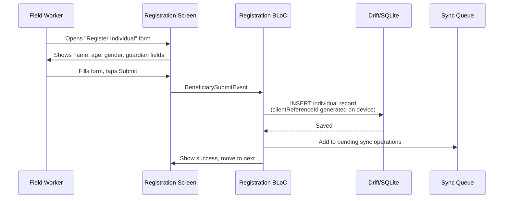
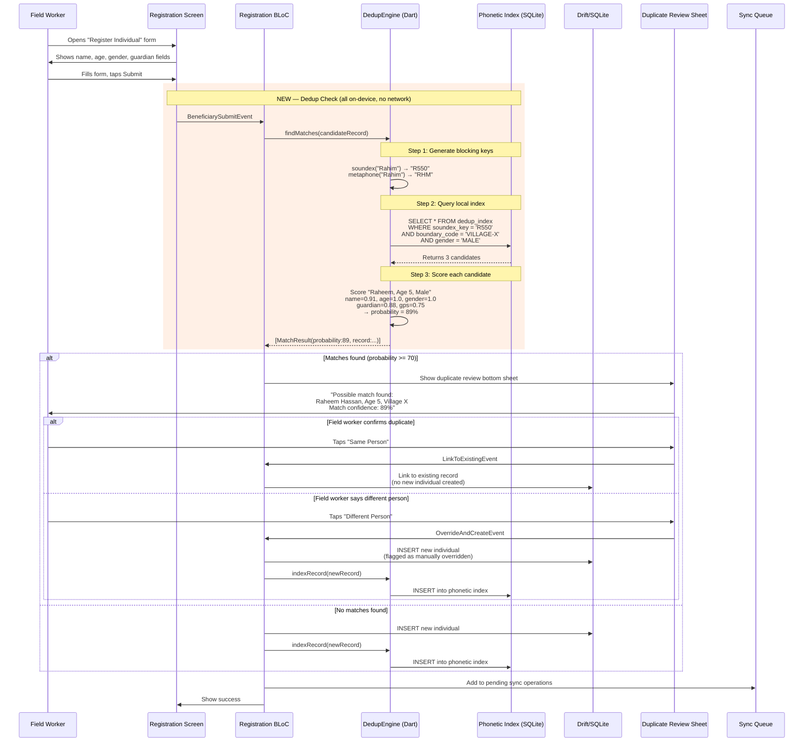
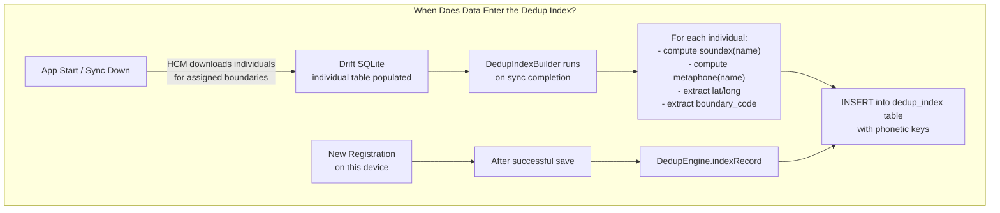
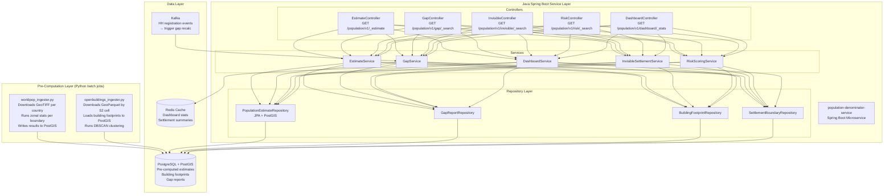
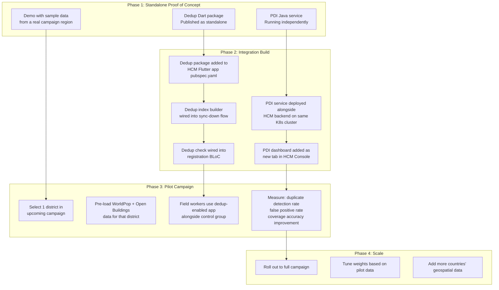
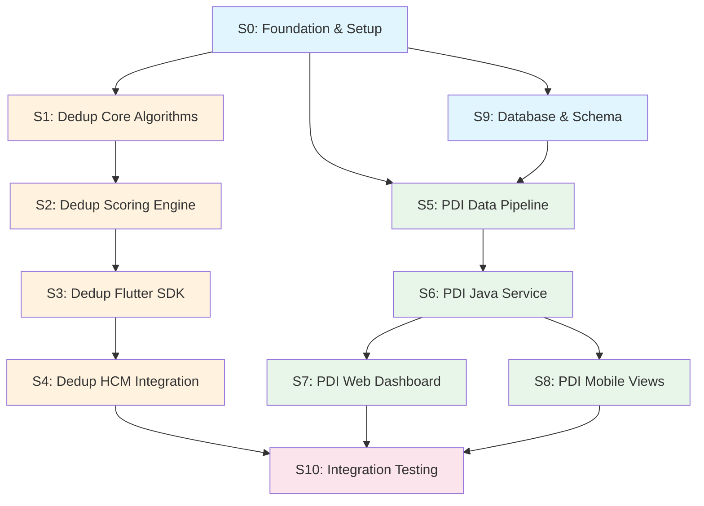
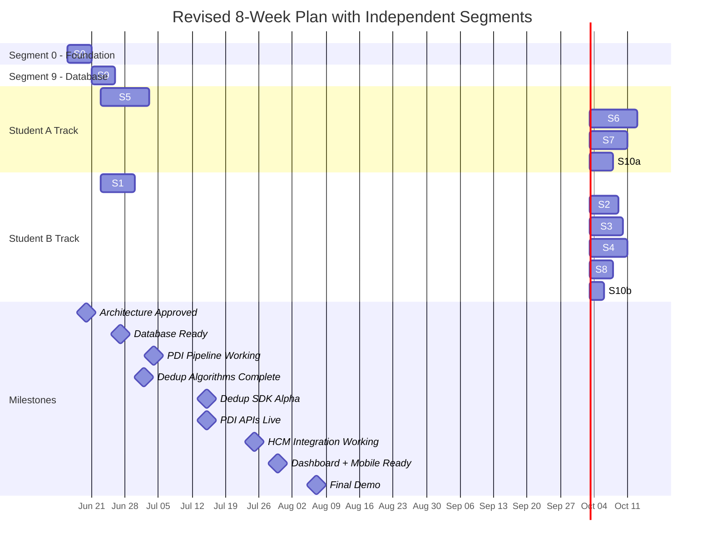

# Detailed Task Plan & Implementation Guide
## Population Denominator Intelligence + Beneficiary Deduplication

**Version:** 2.0
**Date:** 2026-06-10
**Status:** Revised based on architectural clarifications

---

## Critical Clarifications Applied

| Original Assumption | Correction |
|---------------------|-----------|
| PDI backend in Python FastAPI | **Java Spring Boot** — all HCM backend services are Java. Geospatial pre-computation batch jobs can be Python scripts, but the API layer must be Java. |
| Dedup "somehow" works offline | Detailed below — the engine runs entirely within the existing HCM Flutter app's Drift/SQLite layer. No network call needed. |
| GPS data format unclear | Confirmed: lat/long values are stored with household/individual records. These are the anchor for spatial cross-referencing. |
| PDI is backend-only | **A dedicated Insights UI is required** — both web dashboard and mobile views showing missed population, coverage gaps, and campaign-level analytics. |

---

## Part A: How the Deduplication Engine Actually Works Offline

This is the most important architectural detail to get right. Here is exactly how it fits into the current HCM app.

### Current HCM App Flow (What Exists Today)



**Problem:** No duplicate check happens between form submission and database insert. If "Rahim, Age 5, Male, Village X" is already in the local DB from a previous registration or sync-down, the system creates a second record.

### New Flow WITH Deduplication Engine



### How the Local Index Gets Populated



### What Lives Where in the SQLite Database

```
Existing HCM Tables (Drift):          New Dedup Tables (Drift extension):
┌─────────────────────┐               ┌─────────────────────────────┐
│ individual           │               │ dedup_index                  │
│  - client_ref_id PK  │──references──▶│  - individual_client_id FK   │
│  - given_name        │               │  - soundex_given             │
│  - family_name       │               │  - metaphone_given           │
│  - date_of_birth     │               │  - soundex_guardian          │
│  - gender            │               │  - boundary_code             │
│  - ...               │               │  - latitude                  │
│                      │               │  - longitude                 │
│ household            │               │  - gender                    │
│  - client_ref_id PK  │               │  - age                       │
│  - member_count      │               │  - given_name (denormalized) │
│  - address_lat       │               │  - guardian_name (denorm.)   │
│  - address_lon       │               └─────────────────────────────┘
│  - boundary_code     │
│  - ...               │               ┌─────────────────────────────┐
│                      │               │ dedup_decision_log           │
│ project_beneficiary  │               │  - candidate_client_id       │
│  - individual_id FK  │               │  - matched_client_id         │
│  - project_id FK     │               │  - probability_score         │
│  - ...               │               │  - decision (LINK/OVERRIDE)  │
│                      │               │  - decided_by                │
└─────────────────────┘               │  - timestamp                 │
                                       │  - synced (0/1)              │
                                       └─────────────────────────────┘
```

### Key Point: Lat/Long Usage in Dedup

You confirmed that lat/long is stored with records. Here is exactly how it's used:

```
GPS Proximity Scoring:
1. New registration at GPS: (-1.1560, 35.1870)
2. Candidate from index at GPS: (-1.1563, 35.1868)
3. Haversine distance = 38 meters
4. Score = max(0, 1 - (38 / 500)) = 0.924
5. This contributes 0.15 * 0.924 = 0.139 to the total score

Why 500m threshold?
- Within same household compound: 0-20m → score ~1.0
- Same village cluster: 20-100m → score 0.8-0.96
- Adjacent villages: 500m+ → score 0.0 (different location)
```

---

## Part B: Population Denominator Intelligence — Full Stack Design

### Backend Service: Java Spring Boot (Aligned with HCM)

Since HCM services are Java Spring Boot, the PDI service must also be Java. Here is the revised architecture:



### Why This Split Works

| Component | Language | Reason |
|-----------|----------|--------|
| Raster ingestion (WorldPop) | Python | `rasterio`, `rasterstats`, `geopandas` have no Java equivalents of comparable quality |
| Building ingestion (Open Buildings) | Python | GeoParquet reading, DBSCAN clustering via scikit-learn |
| API service layer | Java Spring Boot | Aligns with HCM service pattern, uses same API gateway, auth, Kafka |
| Database | PostgreSQL + PostGIS | Shared by Python (writes) and Java (reads) |

The Python jobs are **batch jobs** that run periodically (on campaign setup or scheduled). They pre-compute everything into PostGIS tables. The Java service simply reads from these pre-computed tables — no raster math at API request time.

### PDI Insights UI

```mermaid
graph TB
    subgraph "Web Dashboard (React — HCM Console Extension)"
        PAGE1[Campaign Coverage Overview<br/>━━━━━━━━━━━━━━━━━━━━━━<br/>Total Expected Pop: 125,400<br/>Total Registered: 89,200<br/>Coverage Gap: 36,200 (28.9%)<br/>━━━━━━━━━━━━━━━━━━━━━━<br/>Bar chart: gap by district]

        PAGE2[Settlement Gap Map<br/>━━━━━━━━━━━━━━━━━━━━━━<br/>Interactive choropleth map<br/>Green/Yellow/Red settlements<br/>Click settlement → detail panel<br/>Filter by gap classification]

        PAGE3[Invisible Settlements<br/>━━━━━━━━━━━━━━━━━━━━━━<br/>Table: unregistered clusters<br/>Building count, est. population<br/>GPS coordinates, distance to nearest<br/>Action: Assign team / Verify]

        PAGE4[Risk Prioritization<br/>━━━━━━━━━━━━━━━━━━━━━━<br/>Ranked table of settlements<br/>Risk score, priority level<br/>Contributing factors breakdown<br/>Filter: CRITICAL / HIGH / MEDIUM]
    end

    subgraph "Mobile Views (Flutter — Field App)"
        MOB1[Settlement Summary Card<br/>━━━━━━━━━━━━━━━━━━━━━━<br/>When supervisor opens an area:<br/>Expected: 1200 | Registered: 680<br/>Gap: 520 people (43%)<br/>Risk: HIGH<br/>▓▓▓▓▓▓▓░░░ 57% coverage]

        MOB2[Mini Gap Map<br/>━━━━━━━━━━━━━━━━━━━━━━<br/>flutter_map with offline tiles<br/>Color-coded assigned boundaries<br/>Tap for settlement detail]
    end
```

### Dashboard API Contract (Java Spring Boot)

```
GET /population/v1/dashboard/_stats?campaignId={id}&boundaryCode={code}

Response:
{
  "campaignId": "CAMP-2026-MALARIA-01",
  "boundaryCode": "DISTRICT-005",
  "summary": {
    "totalEstimatedPopulation": 125400,
    "totalRegisteredPopulation": 89200,
    "totalPopulationGap": 36200,
    "overallCoverageRatio": 0.711,
    "totalEstimatedHouseholds": 25080,
    "totalRegisteredHouseholds": 18400,
    "householdGap": 6680,
    "invisibleSettlementCount": 12,
    "invisibleEstimatedPopulation": 840
  },
  "gapDistribution": {
    "GREEN": { "count": 45, "population": 52000 },
    "YELLOW": { "count": 23, "population": 41200 },
    "RED": { "count": 18, "population": 32200 }
  },
  "topGapSettlements": [
    { "name": "Village Kora", "gap": 820, "coverageRatio": 0.32, "risk": "CRITICAL" },
    { "name": "Village Mawa", "gap": 610, "coverageRatio": 0.41, "risk": "HIGH" }
  ],
  "riskDistribution": {
    "CRITICAL": 8,
    "HIGH": 15,
    "MEDIUM": 28,
    "LOW": 35
  }
}
```

### UI Wireframes (Web Dashboard)

```
┌────────────────────────────────────────────────────────────────────┐
│  HCM Console  │  Campaigns  │  [Population Intelligence]  │  ...  │
├────────────────────────────────────────────────────────────────────┤
│                                                                    │
│  Campaign: Malaria SMC 2026 - District Mopti                      │
│  ┌──────────────────────────────────────────────────────────────┐  │
│  │  ┌──────────┐  ┌──────────┐  ┌──────────┐  ┌──────────┐    │  │
│  │  │ Expected │  │Registered│  │   Gap    │  │ Invisible│    │  │
│  │  │ 125,400  │  │  89,200  │  │  36,200  │  │ 12 sites │    │  │
│  │  │ people   │  │ people   │  │ (28.9%)  │  │ ~840 ppl │    │  │
│  │  └──────────┘  └──────────┘  └──────────┘  └──────────┘    │  │
│  └──────────────────────────────────────────────────────────────┘  │
│                                                                    │
│  ┌──────────────────────────┐  ┌───────────────────────────────┐  │
│  │                          │  │  Top Gap Settlements           │  │
│  │    [CHOROPLETH MAP]      │  │  ─────────────────────────     │  │
│  │                          │  │  1. Village Kora   ●RED        │  │
│  │  ██ Green (on track)     │  │     Gap: 820 | Risk: CRITICAL │  │
│  │  ██ Yellow (moderate)    │  │  2. Village Mawa   ●RED        │  │
│  │  ██ Red (critical)       │  │     Gap: 610 | Risk: HIGH     │  │
│  │  ⬤  Invisible sites     │  │  3. Village Niono  ●YELLOW     │  │
│  │                          │  │     Gap: 340 | Risk: HIGH     │  │
│  │                          │  │  4. Village Segou  ●YELLOW     │  │
│  │                          │  │     Gap: 280 | Risk: MEDIUM   │  │
│  └──────────────────────────┘  └───────────────────────────────┘  │
│                                                                    │
│  ┌──────────────────────────────────────────────────────────────┐  │
│  │  Gap by Sub-District                                         │  │
│  │  ▓▓▓▓▓▓▓▓▓▓▓▓▓▓▓▓░░░░░░  Koro     68% covered             │  │
│  │  ▓▓▓▓▓▓▓▓▓▓▓░░░░░░░░░░░  Bankass  52% covered             │  │
│  │  ▓▓▓▓▓▓▓▓▓▓▓▓▓▓▓▓▓▓░░░░  Mopti    82% covered             │  │
│  │  ▓▓▓▓▓▓▓▓░░░░░░░░░░░░░░  Djenne   38% covered             │  │
│  └──────────────────────────────────────────────────────────────┘  │
└────────────────────────────────────────────────────────────────────┘
```

---

## Part C: Rollout Strategy

### How These Features Get Deployed into HCM



### Integration Points with Existing HCM Code

```
HCM Flutter App (existing)                  What We Add
══════════════════════════                   ══════════════════════
pubspec.yaml                                + digit_dedup_engine: ^1.0.0
                                            + digit_pdi_client: ^1.0.0
                                            + digit_gis_widgets: ^1.0.0

lib/data/local_store/
  sql_store.dart (Drift DB)     ──────────▶ Add dedup_index table
                                            Add dedup_decision_log table
                                            (Drift migration v+1)

lib/blocs/
  beneficiary_registration.dart ──────────▶ Add DedupEngine.findMatches()
                                            call before INSERT
                                            Add DuplicatesFound state

lib/pages/
  beneficiary_registration.dart ──────────▶ Add DuplicateReviewBottomSheet
                                            widget when duplicates found

lib/data/repositories/
  sync_down.dart               ──────────▶ After individual sync-down,
                                            call DedupIndexBuilder.rebuild()

lib/router/                    ──────────▶ Add route for /pdi-dashboard
                                            (mobile settlement summary)

HCM Java Backend (existing)                 What We Add
══════════════════════════                   ══════════════════════
helm/charts/                   ──────────▶ + population-denominator-service
                                            (new Java Spring Boot chart)

kafka topics                   ──────────▶ + household-registration-events
                                            consumed by PDI for gap recalc

HCM Console (React)                         What We Add
══════════════════════════                   ══════════════════════
src/pages/                     ──────────▶ + PopulationIntelligence/
                                              CoverageOverview.tsx
                                              GapMap.tsx
                                              InvisibleSettlements.tsx
                                              RiskPrioritization.tsx
```

---

## Part D: Task Breakdown — Independent Work Segments

Each segment below is designed to be **independently buildable and testable**. Dependencies between segments are explicitly marked.

### Segment Map



---

### Segment 0: Foundation & Setup
**Duration:** Week 1 | **Both Students** | **No dependencies**

| Task ID | Task | Description | Student |
|---------|------|-------------|---------|
| S0.1 | Repository setup | Monorepo with folders: `/dedup-engine`, `/pdi-service`, `/pdi-batch`, `/pdi-dashboard`, `/docs` | Both |
| S0.2 | Dev environment — Java | JDK 17, Spring Boot 3.x, PostgreSQL 15 + PostGIS 3.4, Redis, Kafka (Docker Compose) | A |
| S0.3 | Dev environment — Flutter | Flutter SDK, create `digit_dedup_engine` package scaffold, set up Drift | B |
| S0.4 | Dev environment — Python | Python 3.11, rasterio, geopandas, scikit-learn for batch jobs | A |
| S0.5 | Docker Compose file | PostgreSQL+PostGIS, Redis, Kafka, Zookeeper — single `docker-compose up` | A |
| S0.6 | CI/CD pipeline | GitHub Actions: Java build, Dart analyze+test, Python lint | Both |
| S0.7 | Sample data acquisition | Download WorldPop GeoTIFF + Open Buildings for 1 test district | A |
| S0.8 | Study HCM source code | Understand Drift schema, BLoC pattern, sync flow, registration BLoC | B |

**Deliverable:** Running dev environment, empty project scaffolds, sample geodata downloaded.

---

### Segment 1: Dedup Core Algorithms (Pure Dart — No Dependencies Outside Dart SDK)
**Duration:** Week 2-3 | **Student B** | **Depends on: S0**

| Task ID | Task | Description | Acceptance Criteria |
|---------|------|-------------|-------------------|
| S1.1 | Jaro-Winkler implementation | Pure Dart implementation of Jaro-Winkler string similarity | `jaro_winkler("Rahim", "Raheem") >= 0.87` |
| S1.2 | Levenshtein distance | Pure Dart, returns normalized similarity (0-1) | `levenshtein("Rahim", "Ibrahim") returns correct distance` |
| S1.3 | Soundex encoder | Adapted Soundex for phonetic keys (4-char code) | `soundex("Rahim") == soundex("Raheem")` |
| S1.4 | Double Metaphone | Handles transliteration variants | `metaphone("Mohammed") == metaphone("Muhammad")` |
| S1.5 | Token Set Ratio | Handles name reordering ("Ali Mohammed" vs "Mohammed Ali") | Score > 0.95 for reordered names |
| S1.6 | Name preprocessing | Lowercase, remove diacritics, normalize whitespace, strip punctuation | Handles Arabic/French name transliterations |
| S1.7 | Haversine distance | GPS distance calculation in pure Dart | Correct within 1m for known coordinate pairs |
| S1.8 | Unit test suite | 50+ test cases with real-world name variants from African contexts | All tests pass, >95% coverage on matchers |

**Deliverable:** `lib/src/matchers/` directory with 5 tested, pure-Dart matcher algorithms + `lib/src/geo/haversine.dart`.

**This segment is fully independent** — no database, no Flutter widgets, no network. Just Dart functions with inputs and outputs.

---

### Segment 2: Dedup Scoring Engine
**Duration:** Week 3-4 | **Student B** | **Depends on: S1**

| Task ID | Task | Description | Acceptance Criteria |
|---------|------|-------------|-------------------|
| S2.1 | DedupConfig model | Configurable weights, thresholds, algorithm selection | Serializable to/from JSON (for MDMS loading) |
| S2.2 | MatchScorer class | Takes candidate + existing record, returns probability 0-100 | Score matches hand-calculated expected values |
| S2.3 | Name scoring ensemble | Combines Jaro-Winkler + Phonetic + Token Set with weights | "Rahim"/"Raheem" → name score ~0.91 |
| S2.4 | Age scoring with tolerance | Gaussian decay: ±2 years = full match, decays beyond | Age 5 vs 5 = 1.0; age 5 vs 8 = ~0.32 |
| S2.5 | GPS proximity scoring | Haversine with 500m decay threshold | 38m → 0.92; 300m → 0.40; 600m → 0.0 |
| S2.6 | BeneficiaryRecord model | Input model with all matchable fields | Compatible with HCM Individual entity |
| S2.7 | MatchResult model | Output model: probability, attribute breakdown, matched record | Serializable, has `toDisplayString()` |
| S2.8 | Scoring integration tests | Test full pipeline: record in → score out | 20+ integration test scenarios |

**Deliverable:** `lib/src/engine/match_scorer.dart` + `lib/src/models/` — complete scoring pipeline, no DB needed yet.

---

### Segment 3: Dedup Flutter SDK (Drift Integration + Package API)
**Duration:** Week 4-5 | **Student B** | **Depends on: S2**

| Task ID | Task | Description | Acceptance Criteria |
|---------|------|-------------|-------------------|
| S3.1 | Drift table definitions | `dedup_index` and `dedup_decision_log` tables in Drift | Generated code compiles, migrations work |
| S3.2 | DedupDao class | Data access: `insertWithIndex`, `findCandidates`, `logDecision` | CRUD operations tested with in-memory SQLite |
| S3.3 | PhoneticIndex class | Generates Soundex + Metaphone keys for a record | Keys consistent with S1.3/S1.4 |
| S3.4 | BlockingStrategy class | Combines phonetic key + boundary + gender for candidate retrieval | Reduces search space by >99% on test data |
| S3.5 | DedupEngine class | Main public API: `findMatches()`, `indexRecord()`, `rebuildIndex()` | < 200ms on 500 records (tested on emulator) |
| S3.6 | DedupIndexBuilder | Bulk indexes existing individuals after sync-down | Indexes 1000 records in < 2 seconds |
| S3.7 | Package barrel file | `digit_dedup_engine.dart` exports only public API | Clean API surface, no internal leaks |
| S3.8 | Package documentation | dartdoc for public classes, README with usage example | `dart doc` generates clean output |
| S3.9 | Performance benchmarks | Benchmark: 100/500/1000/5000 records, measure latency | Results documented, < 200ms for 500 records |

**Deliverable:** Complete `digit_dedup_engine` package, publishable to pub.dev or private registry.

---

### Segment 4: Dedup HCM App Integration
**Duration:** Week 6-7 | **Student B** | **Depends on: S3**

| Task ID | Task | Description | Acceptance Criteria |
|---------|------|-------------|-------------------|
| S4.1 | DuplicateReviewBottomSheet | Flutter widget showing match card with scores | Shows matched name, age, guardian, score |
| S4.2 | DuplicateBanner widget | Inline warning banner for registration form | Color-coded by match confidence |
| S4.3 | DedupSearchBloc | BLoC that wraps DedupEngine for registration flow | Emits DuplicatesFound / NoDuplicates states |
| S4.4 | Registration BLoC integration | Wire dedup check into existing registration submit flow | Dedup check fires on every submit |
| S4.5 | Sync-down index rebuild | After HCM sync-down completes, rebuild dedup index | Index up-to-date after every sync |
| S4.6 | Decision logging | Log accept/reject/override decisions for training data | Decisions synced to server with next sync-up |
| S4.7 | Server-side dedup endpoint | Java Spring Boot: POST `/dedup/v1/_search` (uses pg_trgm) | Returns matches with probabilities |
| S4.8 | Server-side batch dedup job | Nightly batch: detect cross-boundary duplicates | Report of suspected duplicates for supervisor |

**Deliverable:** Working dedup flow in HCM app — field worker sees duplicate warnings during registration, both online and offline.

---

### Segment 5: PDI Data Pipeline (Python Batch Jobs)
**Duration:** Week 2-3 | **Student A** | **Depends on: S0, S9**

| Task ID | Task | Description | Acceptance Criteria |
|---------|------|-------------|-------------------|
| S5.1 | WorldPop downloader | Script to download country GeoTIFF via STAC API | Downloads Mali population raster (~200MB) |
| S5.2 | Raster-to-PostGIS loader | Load GeoTIFF into PostGIS raster catalog | `ST_Value` queries return population values |
| S5.3 | Zonal statistics calculator | For each boundary polygon, compute sum of pixel values | Estimated population per boundary stored |
| S5.4 | Open Buildings downloader | Download GeoParquet by S2 cell for campaign country | Buildings loaded for test district |
| S5.5 | Building-to-PostGIS loader | Parse CSV/GeoParquet, filter by confidence, INSERT | Building footprints queryable with spatial index |
| S5.6 | Building-to-boundary assignment | `ST_Within(building.centroid, boundary.polygon)` | Each building assigned a `boundary_code` |
| S5.7 | Population estimation ensemble | Combine WorldPop + building count, compute confidence | Estimates match hand-calculated values |
| S5.8 | DBSCAN settlement clustering | Cluster buildings, detect invisible settlements | Clusters with no registered HH flagged |
| S5.9 | Gap calculator | Compare estimates vs HCM registered counts | Gap reports generated per settlement |
| S5.10 | Risk scorer | Weighted scoring with configurable weights | Risk scores 0-100 per settlement |
| S5.11 | Pipeline orchestration | Single script: `python run_pipeline.py --country=MLI --campaign=CAMP-001` | Full pipeline runs end-to-end |

**Deliverable:** Python batch pipeline that pre-computes all PDI data into PostGIS tables, ready for the Java service to read.

---

### Segment 6: PDI Java Spring Boot Service
**Duration:** Week 4-5 | **Student A** | **Depends on: S5, S9**

| Task ID | Task | Description | Acceptance Criteria |
|---------|------|-------------|-------------------|
| S6.1 | Spring Boot project scaffold | Standard HCM service structure: controller/service/repository/model | Compiles, health check endpoint works |
| S6.2 | JPA entities + PostGIS | Entity classes for PopulationEstimate, GapReport, InvisibleSettlement | `ST_Within` queries work via Hibernate Spatial |
| S6.3 | Estimate endpoint | `GET /population/v1/_estimate?boundaryCode={code}` | Returns pre-computed estimate from PostGIS |
| S6.4 | Gap search endpoint | `POST /population/v1/gap/_search` with filters | Filterable by campaign, classification, boundary |
| S6.5 | Invisible settlements endpoint | `GET /population/v1/invisible/_search` | Returns unregistered building clusters |
| S6.6 | Risk search endpoint | `POST /population/v1/risk/_search` with sorting | Sorted by risk score descending |
| S6.7 | Dashboard stats endpoint | `GET /population/v1/dashboard/_stats` | Aggregated stats for campaign overview |
| S6.8 | Kafka consumer | Listen to household registration events, trigger gap recalc | Gap reports update when new HH registered |
| S6.9 | Redis caching | Cache dashboard stats and settlement summaries | < 50ms response for cached requests |
| S6.10 | GeoJSON tile endpoint | Serve settlement boundary GeoJSON for map | Valid GeoJSON with gap colors as properties |
| S6.11 | OpenAPI spec | Swagger UI documentation for all endpoints | Spec matches API contract document |
| S6.12 | Integration tests | TestContainers with PostGIS for repository tests | All endpoints tested with realistic data |

**Deliverable:** Running Java microservice with all PDI APIs, deployable alongside HCM backend.

---

### Segment 7: PDI Web Dashboard (React)
**Duration:** Week 6-7 | **Student A** | **Depends on: S6**

| Task ID | Task | Description | Acceptance Criteria |
|---------|------|-------------|-------------------|
| S7.1 | Dashboard page scaffold | New route in HCM Console: `/population-intelligence` | Page loads, navigation works |
| S7.2 | Coverage overview cards | 4 KPI cards: Expected, Registered, Gap, Invisible | Data from dashboard stats API |
| S7.3 | Choropleth map component | Leaflet/MapLibre with GeoJSON boundaries colored by gap | Green/Yellow/Red fill renders correctly |
| S7.4 | Settlement detail panel | Click settlement on map → side panel with full stats | Shows estimates, gap, risk, building count |
| S7.5 | Gap by sub-district chart | Horizontal bar chart showing coverage ratio per sub-area | Sorted by coverage ratio ascending |
| S7.6 | Invisible settlements table | Sortable table with GPS, building count, actions | "Assign Team" button creates task |
| S7.7 | Risk prioritization view | Ranked table with risk score and factor breakdown | Sortable, filterable by priority |
| S7.8 | Campaign selector | Dropdown to switch between campaigns | Dashboard refreshes for selected campaign |

**Deliverable:** Functional web dashboard with map visualization, accessible from HCM Console.

---

### Segment 8: PDI Mobile Views (Flutter)
**Duration:** Week 6-7 | **Student B (supporting A)** | **Depends on: S6**

| Task ID | Task | Description | Acceptance Criteria |
|---------|------|-------------|-------------------|
| S8.1 | `digit_pdi_client` package | HTTP client for PDI APIs + Drift cache for offline | Fetches and caches settlement summaries |
| S8.2 | Settlement summary card | Widget showing coverage stats for tapped boundary | Expected, registered, gap, risk displayed |
| S8.3 | Mini gap map | `flutter_map` with offline MBTiles + GeoJSON overlay | Green/Yellow/Red boundaries visible offline |
| S8.4 | Coverage progress bar | Visual indicator: estimated vs registered with colors | Animates, shows percentage |
| S8.5 | Offline tile download | During sync, download MBTiles for assigned boundaries | Map works fully offline after download |

**Deliverable:** Mobile map views and settlement cards for field supervisors.

---

### Segment 9: Database & Schema
**Duration:** Week 1-2 | **Student A** | **Depends on: S0**

| Task ID | Task | Description | Acceptance Criteria |
|---------|------|-------------|-------------------|
| S9.1 | PostGIS schema DDL | All tables from architecture doc: settlement_boundary, population_estimate, gap_report, invisible_settlement, building_footprint, risk_score_config | DDL executes on PostGIS, spatial indexes created |
| S9.2 | Dedup schema DDL | dedup_record, duplicate_pair, merge_audit with pg_trgm | DDL executes, trigram indexes created |
| S9.3 | Flyway migrations | Versioned migrations for Java service | Flyway runs clean on fresh DB |
| S9.4 | Drift migration (Flutter) | Add dedup_index and dedup_decision_log to existing Drift DB | Migration increments Drift schema version |
| S9.5 | Seed data script | Populate test district with sample boundaries, buildings, population | Realistic test data for development |

**Deliverable:** Complete database ready for both Python writes and Java reads, plus Flutter local schema.

---

### Segment 10: Integration Testing & Documentation
**Duration:** Week 8 | **Both Students** | **Depends on: S4, S7, S8**

| Task ID | Task | Description | Acceptance Criteria |
|---------|------|-------------|-------------------|
| S10.1 | End-to-end dedup test | Register duplicate beneficiaries, verify detection on device | Duplicate flagged within 200ms |
| S10.2 | End-to-end PDI test | Run pipeline → API → dashboard for test district | Dashboard shows accurate gap data |
| S10.3 | Offline scenario test | Airplane mode: register + dedup + view settlement card | All features work without network |
| S10.4 | Performance test | Dedup latency on low-end device emulator (2GB RAM) | < 200ms per registration check |
| S10.5 | Cross-boundary dedup test | Sync-up → server-side batch dedup finds cross-village duplicates | Server flags matches with probability |
| S10.6 | API documentation | OpenAPI specs for all endpoints | Swagger UI accessible |
| S10.7 | Deployment guide | Docker Compose for local, Helm chart for K8s | `docker-compose up` runs full stack |
| S10.8 | Architecture Decision Records | Document all key decisions with rationale | ADRs in `/docs/decisions/` |
| S10.9 | Demo preparation | Script, test data, and presentation for final demo | Demo covers both PDI and dedup flows |

---

## Part E: Revised Weekly Schedule



### Week-by-Week Owner View

| Week | Student A | Student B | Joint |
|------|-----------|-----------|-------|
| **W1** Jun 16 | Docker Compose, Python env, download geodata (S0, S5.1) | Flutter env, study HCM source, Drift schema (S0, S3.1) | Repo setup, CI/CD, architecture review (S0, S9) |
| **W2** Jun 23 | WorldPop + Open Buildings ingestion (S5.1-S5.6) | Jaro-Winkler, Soundex, Metaphone, Levenshtein (S1.1-S1.5) | Schema finalized (S9) |
| **W3** Jun 30 | Population estimation + DBSCAN + gap calc (S5.7-S5.11) | Token Set, preprocessing, haversine, tests (S1.6-S1.8, S2.1-S2.3) | |
| **W4** Jul 7 | Spring Boot scaffold, JPA entities (S6.1-S6.4) | Scoring engine complete, Drift integration (S2.4-S2.8, S3.1-S3.2) | |
| **W5** Jul 14 | API endpoints, Kafka, Redis (S6.5-S6.12) | DedupEngine, indexing, blocking, package API (S3.3-S3.9) | **Mid-point demo** |
| **W6** Jul 21 | Dashboard scaffold, KPI cards, map (S7.1-S7.4) | Dedup UI widgets, BLoC, registration integration (S4.1-S4.4) | |
| **W7** Jul 28 | Charts, tables, campaign selector (S7.5-S7.8) | Sync-down index, decision logging, server dedup (S4.5-S4.8), mobile map (S8) | Cross-team integration |
| **W8** Aug 4 | E2E PDI test, API docs, deployment guide (S10) | E2E dedup test, offline test, perf test (S10) | Demo prep, ADRs, final delivery |

---

## Part F: What Can Be Worked in Parallel

```
FULLY PARALLEL (no dependency between them):
━━━━━━━━━━━━━━━━━━━━━━━━━━━━━━━━━━━━━━━━━━
Student A: S5 (PDI Pipeline)     ║    Student B: S1 (Dedup Algorithms)
Student A: S5 (PDI Pipeline)     ║    Student B: S2 (Scoring Engine)
Student A: S6 (Java Service)     ║    Student B: S3 (Flutter SDK)
Student A: S7 (Web Dashboard)    ║    Student B: S4 (HCM Integration)

SEQUENTIAL CHAINS (must be done in order):
━━━━━━━━━━━━━━━━━━━━━━━━━━━━━━━━━━━━━━━━━━
Student A: S0 → S9 → S5 → S6 → S7 → S10
Student B: S0 → S1 → S2 → S3 → S4 → S8 → S10

CROSS-TEAM DEPENDENCY:
━━━━━━━━━━━━━━━━━━━━━━━━━━━━━━━━━━━━━━━━━━
S6 must be done before S8 (mobile views need API)
S9 must be done before S5 (pipeline needs schema)
```

---

## Part G: Summary of Key Architecture Corrections

| What Changed | Why |
|-------------|-----|
| PDI API layer is now **Java Spring Boot**, not Python | HCM backend is Java — must follow the same service pattern for API gateway, auth, Kafka integration |
| Python is retained only for **batch pre-computation** | rasterio/geopandas have no Java equivalents; batch jobs write to PostGIS, Java reads from PostGIS |
| Explicit **offline dedup flow** documented step-by-step | Must be crystal clear how this works without network — it's the core value proposition |
| **Lat/long usage** explicitly mapped to GPS proximity scoring | Haversine distance with 500m decay; existing GPS data is directly usable |
| **PDI Insights UI** designed with wireframes | Web dashboard (React) + mobile settlement cards (Flutter); not just a backend |
| **Rollout strategy** is phased: standalone → integration → pilot → scale | Avoids big-bang deployment; validates with real campaign data first |
| Dashboard API endpoint added | `GET /population/v1/dashboard/_stats` provides aggregated campaign-level statistics for the UI |
