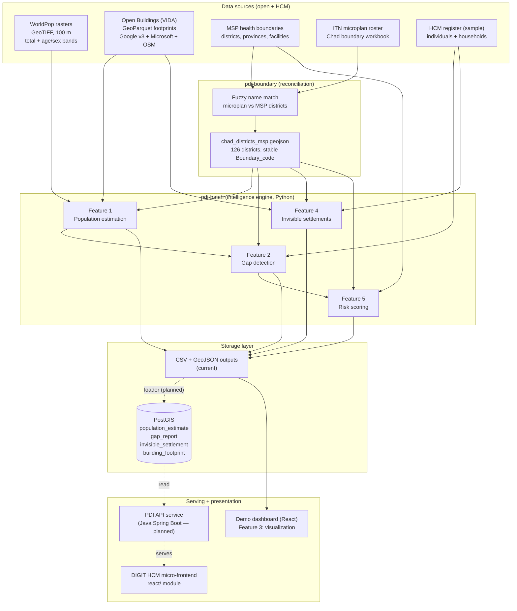
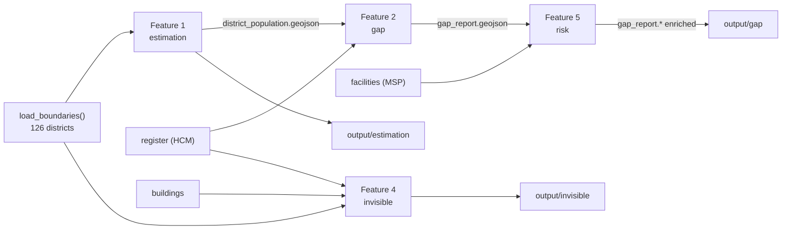
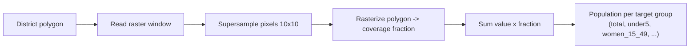
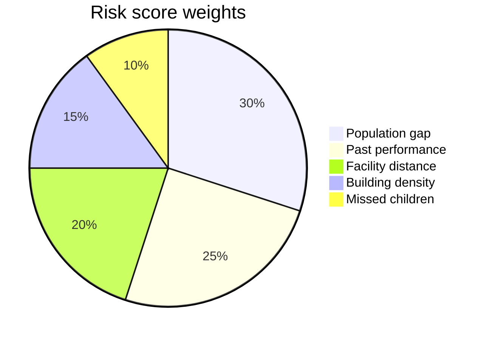
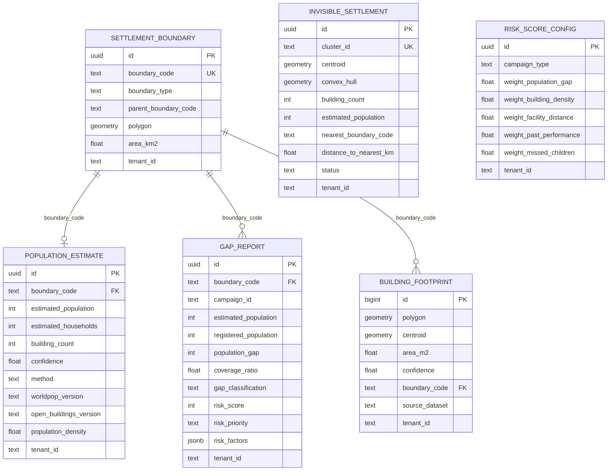
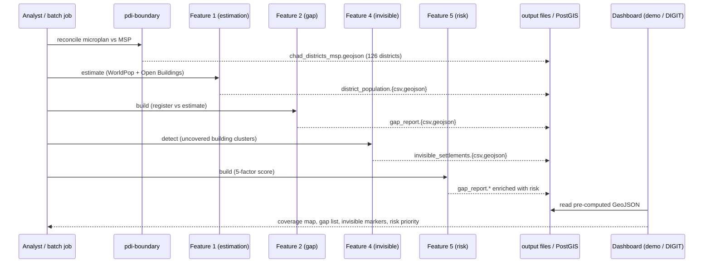
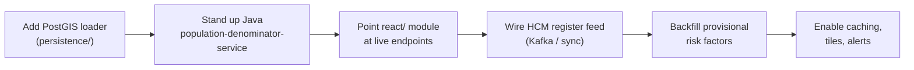

# Population Denominator Intelligence (PDI)

A geospatial intelligence layer for the DIGIT **Health Campaign Management (HCM)** platform. PDI
estimates the *expected* population and households for every campaign area from open satellite and
building-footprint data, compares that expectation against who was actually registered in the field,
and surfaces the coverage gaps, unmapped settlements, and risk hotspots that a manual microplan
cannot see.

The current reference deployment targets **Chad**, validating the national ITN (insecticide-treated
net) microplan across all **126 MSP health districts**, with a registered-beneficiary sample in
N'Djamena.

---

## 1. The problem PDI solves

Campaign coverage today is measured as `served / registered`. The flaw is that **"registered" is not
"actual population"** — field enumeration misses households and whole settlements, so the denominator
is wrong and coverage looks better than it is.

```
If 800 people are registered out of 1,200 who actually live there:
  HCM today reports   800 / 800  = 100%   (on track)
  Reality is          800 / 1200 = 67%    (400 people invisible)
```

PDI supplies an **independent denominator** derived from WorldPop population rasters and Open
Buildings footprints, then does the gap arithmetic per district so supervisors can act on the
difference.

---

## 2. Architecture at a glance

PDI is a **batch pre-computation layer**. Heavy geospatial math (raster zonal statistics, spatial
joins, clustering) runs offline in Python and writes compact, indexed results. The serving path only
ever reads those pre-computed results — no raster math at request time. This mirrors DIGIT's
convention of Python for offline analytics and Java Spring Boot for the request-serving API.



**Legend:** solid arrows are implemented today; dotted arrows (`PostGIS loader`, `Java API`) are the
integration work still to be built (see [§9](#9-digit-health-integration-current-state-and-plan)).

---

## 3. Repository layout

| Path | What it is | Status |
|------|------------|--------|
| `pdi-boundary/` | Reconciles the ITN microplan roster against MSP district polygons and emits the common **engine boundary** every downstream feature keys off. | Working |
| `pdi-batch/` | The intelligence engine: five features over the engine boundary, plus the data-source adapters. | Working |
| `pdi-batch/sources/` | Adapters for WorldPop, Open Buildings, boundaries, the HCM register, and facilities. | Working |
| `pdi-batch/features/` | Feature 1 estimation, 2 gap, 4 invisible, 5 risk. | Working |
| `pdi-batch/output/` | Pre-computed CSV + GeoJSON per feature (gitignored). | Generated |
| `db/` | PostGIS schema as Flyway migrations (`V1`–`V4`) plus init SQL. | Schema ready |
| `react/` | DIGIT HCM micro-frontend module (dashboard shell + `PDIService` API client). | Scaffold |
| `demo/` | Standalone React + Leaflet demo that renders the pre-computed GeoJSON (Feature 3). | Working, gitignored |
| `Data_Source/` | Input rasters, footprints, boundaries, register (large files gitignored). | Local |
| `docker-compose.yml` | PostGIS 15 / PostGIS 3.4, plus Redis and Kafka under the `full` profile. | Working |

---

## 4. The two pipelines

### 4.1 Boundary reconciliation (`pdi-boundary`)

Chad has two district vocabularies that do not share codes: the **ITN microplan** roster (campaign
targets) and the **MSP 2020 health districts** (authoritative polygons). `reconcile/districts.py`
fuzzy-matches district names (normalized, `difflib` ratio ≥ 0.82) and produces the engine boundary:

- **Every** MSP health district is kept (126 rows), keyed by a stable `Boundary_code` derived from the
  MSP pcode (`MSP_<pcode>`, de-duplicated).
- Where a microplan name lines up, its code/targets are attached as optional columns; otherwise they
  are left null. This lets the engine run over the complete MSP layer today while richer microplan
  geometry can be joined later on the same key.

Output: `pdi-boundary/output/chad_districts_msp.geojson` — the single boundary contract consumed by
every `pdi-batch` feature (`config.BOUNDARY_GEOJSON`, `config.BOUNDARY_CODE_FIELD = "Boundary_code"`).

### 4.2 Intelligence engine (`pdi-batch`)

Five features, each a standalone module with a `main()` (runnable via `python -m features.<name>`)
and a callable `build()/estimate()/detect()` returning `(table, gdf)`. Features chain through files:
estimation feeds gap, gap feeds risk.



---

## 5. Data-source interaction: WorldPop and Open Buildings

These two datasets are the heart of the denominator. Here is exactly how each is read and turned into
numbers.

### 5.1 WorldPop (population raster) — `sources/worldpop.py`

WorldPop ships one all-ages raster plus per-age/sex 100 m GeoTIFF bands for Chad (`tcd_<sex>_<age>_…`).
For each district polygon the engine computes **coverage-weighted zonal sums**:

1. Read only the raster window covering the polygon bounding box (`rasterio`).
2. **Sub-pixel supersampling** (`COVERAGE_SUBSAMPLE = 10`): each 100 m pixel is diced 10×10, the
   polygon is rasterized onto the fine grid, and the fraction of each coarse pixel actually inside the
   polygon becomes its weight. `population = Σ (pixel_value × covered_fraction)`.
3. This coverage-weighting (rather than naive pixel-center-in-polygon) is what fixed the N'Djamena
   sub-pixel undercount — small dense urban catchments were previously reading ~0.

The same routine runs for **every configured target group** in `config.TARGET_GROUPS`, giving each
district a selectable denominator for **60+ cohorts**: `total`, `under5`, `under15`,
`women_15_49`, single age bands (`age_00` … `age_90_plus`), and each of those split by sex. A
bounding-box **sanity check** compares measured totals against WorldPop control figures within a 2%
tolerance before the run is trusted.



### 5.2 Open Buildings via VIDA (footprints) — `sources/buildings.py`

Building footprints come from the **VIDA combined Open Buildings** GeoParquet (`TCD.parquet`), which
merges **Google Open Buildings v3 + Microsoft + OSM**. Reading:

1. Spatial-filter to the boundary bounding box (`bbox=` pushdown when the parquet has a covering-bbox
   column, else `.cx` fallback).
2. **Confidence filter:** keep Google footprints with `confidence ≥ 0.70`; keep all null-confidence
   footprints (Microsoft/OSM carry no score).
3. Assign each building to a district by **representative-point-within** spatial join, tagging it with
   `boundary_code`.

Buildings are used two ways: as a **household proxy** in Feature 1 (`count × 5.4 avg household size`),
and as the raw material for **Feature 4** clustering.

### 5.3 The ensemble (Feature 1) — `features/estimation.py`

WorldPop and buildings are cross-validated rather than trusted blindly:

```
buildingEstimate = buildingCount * AVG_HOUSEHOLD_SIZE      # 5.4
divergence       = |worldpop - buildingEstimate| / worldpop

if buildings present and divergence < 0.30:                # methods agree
    population = 0.6*worldpop + 0.4*buildingEstimate
    confidence = 0.85 + 0.15*(1 - divergence)              # high, method = "ensemble"
else:                                                       # methods diverge
    population = worldpop                                   # WorldPop primary
    confidence = 0.50 + 0.2*min(buildingCount/10, 1)       # flagged, method = "worldpop_primary"
```

Each district also gets an equal-area area (`EPSG:6933`) and resulting population density. Result:
`output/estimation/district_population.{csv,geojson}`.

---

## 6. The five features

| # | Feature | Module | Core technique | Output |
|---|---------|--------|----------------|--------|
| 1 | Population estimation | `features/estimation.py` | WorldPop zonal stats + Open Buildings ensemble | `estimation/district_population.*` |
| 2 | Gap detection | `features/gap.py` | estimated vs registered → coverage ratio + classification | `gap/gap_report.*` |
| 3 | Visualization | `demo/` + `react/` | Leaflet/MapLibre choropleth over GeoJSON | web dashboard |
| 4 | Invisible settlements | `features/invisible.py` | DBSCAN on uncovered building centroids | `invisible/invisible_settlements.*` |
| 5 | Risk scoring | `features/risk.py` | explainable 5-factor weighted model | enriches `gap_report.*` |

### Feature 2 — gap detection

Registered individuals and households (from the HCM register) are spatially joined into districts and
compared against the Feature 1 estimate:

```
coverageRatio = registeredPopulation / estimatedPopulation

GREEN   ratio >= 0.85
YELLOW  0.50 <= ratio < 0.85
RED     ratio < 0.50
BLACK   registered = 0 but buildings > 0   (a built-up district with nobody registered)
```

`--scope national` classifies every district (uncovered ones fall to BLACK); `--scope ndjamena`
restricts to districts the register actually covers. On the current national run the register is a
N'Djamena sample, so most districts are correctly BLACK — the report does not fudge coverage it does
not have.

### Feature 4 — invisible settlement detection

Finds clusters of buildings that **no registered household reaches**, i.e. settlements the campaign
never enumerated:

1. Filter to buildings with no registered household within `INVISIBLE_BUFFER_METERS = 200`
   (one STRtree-indexed nearest query over the whole set — `O(n log m)`, not a per-building loop).
2. **DBSCAN** the uncovered centroids per district (`eps = 100 m`, `min_samples = 3`).
3. Each cluster's footprint is the **concave hull** (alpha shape, `ratio = 0.1`) of its buildings, so
   a sprawling settlement follows its real outline instead of a convex hull that bridges gaps.
4. Attach nearest registered district, distance, centroid, and a `UNVERIFIED` status for field
   follow-up.

### Feature 5 — explainable risk scoring

A transparent weighted linear model (weights are configurable, seeded in `risk_score_config`), scoring
each district 0–100 and enriching the gap report in place:



- **Population gap** — `populationGap / estimatedPopulation`, clamped 0–1.
- **Facility distance** — km from the district's interior point to the nearest MSP facility, saturating
  at `RISK_FACILITY_MAX_KM = 50`; farther = less access = higher risk.
- **Building density** — buildings per km², min-max normalized across districts in scope.
- **Past performance** and **missed children** — no data feed yet: held at a neutral `0.5` and flagged
  `provisional` in the per-factor `risk_factors` JSON, so the score is honest about what it does and
  doesn't yet know.

Bands: `CRITICAL ≥ 75`, `HIGH ≥ 50`, `MEDIUM ≥ 25`, else `LOW`. The full per-factor breakdown (score,
weight, provisional flag) is written to `risk_factors` (jsonb) for explainability.

---

## 7. Data models

The serving-side schema is defined as Flyway migrations under `db/migration/` (`V1` PostGIS
extensions, `V2` boundaries, `V3` PDI tables, `V4` risk-config seed). Every table is tenant-scoped
(`tenant_id`) to fit DIGIT multi-tenancy, and all geometry is stored as `EPSG:4326`.



`gap_classification` is constrained to `GREEN/YELLOW/RED/BLACK`; `risk_priority` to
`CRITICAL/HIGH/MEDIUM/LOW`; `gap_report` is unique per `(campaign_id, boundary_code)` with indexes on
`(campaign_id, gap_classification)` and `(campaign_id, risk_score DESC)` for dashboard queries. The
Python feature outputs are shaped to load 1:1 into these tables (column names and value domains already
match).

---

## 8. End-to-end flow and how the pieces fit



Everything keys off one join column, `Boundary_code`, from the boundary layer through estimation, gap,
and risk, so the layers compose without any re-matching.

### Quickstart

```bash
python -m venv .venv && source .venv/Scripts/activate   # Windows Git Bash
pip install -r requirements.txt

# 1. Build the engine boundary (126 MSP districts)
cd pdi-boundary && python -m reconcile.districts && cd ..

# 2. Run the intelligence engine
cd pdi-batch
python -m features.estimation          # Feature 1  (add --no-buildings to skip the VIDA cross-check)
python -m features.gap --scope national # Feature 2
python -m features.invisible --scope ndjamena  # Feature 4
python -m features.risk                 # Feature 5 (enriches the gap report)
pytest                                  # source + feature tests
```

The PostGIS/Redis/Kafka stack for the serving path is `docker compose up postgis` (add `--profile
full` for Redis + Kafka); schema is applied with Flyway from `db/migration`.

### Representative current run (national scope)

| Metric | Value |
|--------|-------|
| Districts estimated | 126 |
| WorldPop population (national, summed) | ~21.1 M |
| Registered (N'Djamena sample) | ~48 k |
| Gap classification | 121 BLACK, 5 RED (register covers only the sample) |
| Risk priority | 2 CRITICAL, 117 HIGH, 7 MEDIUM |
| Invisible settlement clusters | ~647 (≈116 k buildings) |

These reflect a synthetic/sample register; they demonstrate the pipeline end-to-end, not a validated
national coverage figure.

---

## 9. DIGIT Health integration: current state and plan

PDI is deliberately built to drop into DIGIT HCM as a new analytics capability without touching core
services. The split is: **Python batch jobs pre-compute into PostGIS; a Java Spring Boot service serves
the DIGIT-standard API; the React micro-frontend renders it.**

### What exists today

- The full **batch pre-computation engine** (Features 1, 2, 4, 5) producing DIGIT-shaped tables.
- The **PostGIS schema** (`db/migration`) matching those outputs, tenant-scoped and campaign-scoped.
- A **DIGIT micro-frontend scaffold** (`react/`) following the `digit-ui-module-health-dss` pattern,
  with a `PDIService` client already written against the intended endpoints (`/pdi/v1/_search`,
  `/pdi/v1/_coverage`) using the DIGIT `RequestInfo` + `tenantId` convention.
- A working **standalone demo dashboard** (`demo/`) proving the visualization layer (Feature 3) over
  the real pre-computed GeoJSON.

### What is missing (the integration work)

1. **PostGIS loader.** `pdi-batch/persistence/` is a placeholder; feature outputs currently land as
   CSV/GeoJSON. A loader is needed to upsert them into `population_estimate`, `gap_report`,
   `invisible_settlement`, and `building_footprint`.
2. **Java `population-denominator-service`.** The request-serving API (Controllers / Services / JPA
   repositories reading the pre-computed tables) is designed but not yet implemented. It backs the
   `/pdi/v1/*` endpoints the React client already calls.
3. **Real HCM register feed.** Gap/invisible currently consume a synthetic register; the production
   path is to read registered households/individuals from HCM (via Kafka consumer or a scheduled sync)
   instead of local files.
4. **Two provisional risk factors.** `past_performance` and `missed_children` need a data source
   (historical campaign coverage, round outcomes) to move off their neutral placeholder.
5. **Serving concerns.** Redis caching of dashboard aggregates, vector-tile serving (pg_tileserv /
   Martin) for map layers, and Kafka events for invisible-settlement alerts are provisioned in
   `docker-compose` but not yet wired.

### Proposed integration sequence



This lets integration proceed incrementally: the batch layer and schema are ready now, so the first
concrete step is the loader + Java read API, after which the existing React module lights up against
real data.

---

## 10. Technology summary

| Concern | Choice | Notes |
|---------|--------|-------|
| Raster zonal stats | `rasterio`, `rasterstats`, `numpy` | coverage-weighted sub-pixel extraction |
| Vector / spatial | `geopandas`, `shapely`, `pyproj`, `pyogrio` | spatial joins, hulls, equal-area density |
| Building I/O | `pyarrow` GeoParquet | VIDA combined Open Buildings |
| Clustering | `scikit-learn` DBSCAN | invisible settlement detection |
| Serving DB | PostgreSQL 15 + PostGIS 3.4 | Flyway migrations; DIGIT-standard |
| Config | `python-dotenv`, central `config.py` | one config module per pipeline |
| API (planned) | Java Spring Boot + Hibernate Spatial | DIGIT convention; reads pre-computed tables |
| Frontend | React micro-frontend (`react/`) + Leaflet demo (`demo/`) | DIGIT HCM module pattern |
| Testing | `pytest` | `pdi-batch/tests`, `pdi-boundary/tests` |

---

## Coordinate reference systems

`EPSG:4326` (WGS84) is the storage CRS for all persisted geometry. Distance and clustering run in a
metric CRS auto-derived per dataset (UTM zone from the data bounds); area and population density use
the equal-area `EPSG:6933`.
